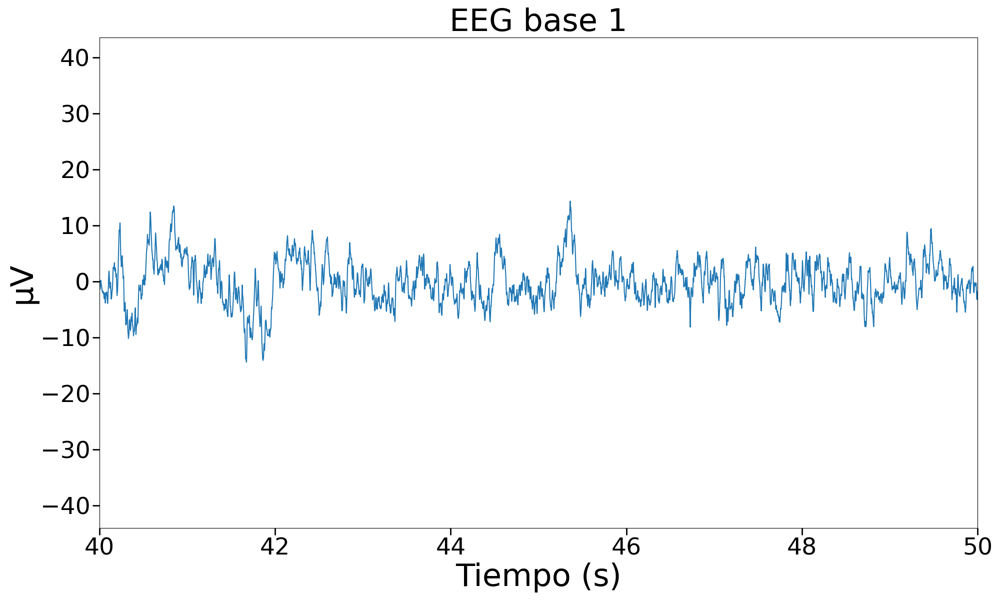
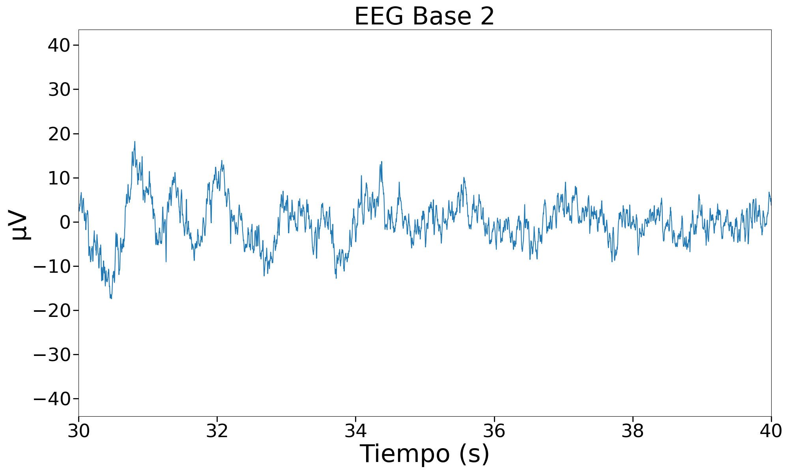

# Uso de BITalino para EEG
Lista de participantes:  
- Mantilla M., Ana Belen  
- Valdivia E., Erick Alexander   
- Flórez T., Armando Antonio  
- Taquiri D., Diego Alejandro  

## Tabla de contenidos
1. [Introducción](https://github.com/diego-taquiri/ISB-equipo11/blob/main/Documentaci%C3%B3n/Laboratorio%2007/BITalino_EEG.md#introducci%C3%B3n)
2. [Objetivos específicos de la práctica](https://github.com/diego-taquiri/ISB-equipo11/blob/main/Documentaci%C3%B3n/Laboratorio%2007/BITalino_EEG.md#objetivos-espec%C3%ADficos-de-la-pr%C3%A1ctica)
3. [Materiales y métodos](https://github.com/diego-taquiri/ISB-equipo11/blob/main/Documentaci%C3%B3n/Laboratorio%2007/BITalino_EEG.md#materiales-y-m%C3%A9todos)
4. [Resultados](https://github.com/diego-taquiri/ISB-equipo11/blob/main/Documentaci%C3%B3n/Laboratorio%2007/BITalino_EEG.md#resultados)
   - [Videos mostrando las conexiones electrodos-cuerpo y la señal ploteada](https://github.com/diego-taquiri/ISB-equipo11/blob/main/Documentaci%C3%B3n/Laboratorio%2007/BITalino_EEG.md#videos-mostrando-las-conexiones-electrodos-cuerpo-y-la-se%C3%B1al-ploteada)
   - [Archivo de los datos de la señal ploteada](https://github.com/diego-taquiri/ISB-equipo11/blob/main/Documentaci%C3%B3n/Laboratorio%2007/BITalino_EEG.md#archivo-de-los-datos-de-la-se%C3%B1al-ploteada)
   - [Ploteo de las señales en Python](https://github.com/diego-taquiri/ISB-equipo11/blob/main/Documentaci%C3%B3n/Laboratorio%2007/BITalino_EEG.md#ploteo-de-las-se%C3%B1ales-en-python)
5. [Discusión](https://github.com/diego-taquiri/ISB-equipo11/blob/main/Documentaci%C3%B3n/Laboratorio%2007/BITalino_EEG.md#discusi%C3%B3n)
6. [Bibliografía](https://github.com/diego-taquiri/ISB-equipo11/blob/main/Documentaci%C3%B3n/Laboratorio%2007/BITalino_EEG.md#bibliograf%C3%ADa)

### Introducción

El EEG registra la actividad eléctrica generada por las neuronas cerebrales, en forma de diferencias de potencial entre electrodos posicionados sobre el cuero cabelludo. Esta actividad es digitalizada, amplificada (en un adulto sano típicamente oscila entre 20-100 μV), filtrada para eliminar o reducir el ruido (generalmente de 0.3 a 70 Hz), y se muestra como formas de onda con morfologías y frecuencias variables. La interpretación de estas formas de onda generalmente se realiza mediante inspección visual, pero también puede llevarse a cabo mediante análisis cuantitativo de la frecuencia, amplitud, distribución topográfica, correlación cruzada y reactividad; estos análisis permiten una evaluación objetiva de la actividad cerebral. [1] 

Aparte de sus aplicaciones en el diagnóstico de patologías neurológicas y del estado de consciencia, en el ámbito de ingeniería biomédica, el EEG tiene un rol importante en el desarrollo de interfaces cerebro computadora (Brain Computer Interface-BCI), que aprovechan la obtención no invasiva de las señales para el control de dispositivos de soporte o reemplazo de funciones o apoyo a la comunicación, funciones que pueden haberse perdido debido a enfermedades o accidentes [2].

### Objetivos específicos de la práctica
- Adquirir señales biomédicas de EEG.
- Hacer una correcta configuración del BiTalino y del UltraCortex.
- Extraer la información de las señales EEG de los softwares OpenSignals (r)evolution y OpenBCI GUI.
- Comprender el cambio de señal desencadenado por cambios de actividad neuronal.

### Materiales y métodos

Se realizó la medición de EEG de acuerdo a las instrucciones de la guía experimental de BITalino sobre bioseñales. [3] La medición se realizó utilizando un cable de electrodo de tres derivaciones conectado al terminal del BITalino correspondiente a EEG (Figura 1).  
   

  

<b>Figura 1.</b> Conexiones de los cables del electrodo en el BITalino.   

 Una posible configuración del sensor de EEG BITalino es la de medición bipolar, la cual contiene dos electrodos de medición (IN + e IN-) y uno de referencia que debe ser conectado de manera adicional en una zona ósea. Siguiendo el sistema internacional 10-20, , el cual es el estándar aceptado internacionalmente para la colocación de electrodos en el contexto del EEG, se colocaron los dos electrodos de medición en FP1 con una distancia predefinida por los broches del sensor; mientras que el electrodo de referencia se colocó en una región neutra. [3] Las posiciones pueden observarse en la figura 2.   

      

    
    

<b>Figura 2.</b> (a) Sistema internacional 10-20 para la (b) colocación de electrodos para la configuración de medición bipolar: electrodos de medición (IN + e IN-) y de referencia. [3]   

El protocolo seguido para evaluar el cambio de señal desencadenado por cambios de actividad neuronal fue el siguiente:  

<ol>
  <li>Registrar una línea base de señal con poco ruido y sin movimientos (respiración normal, sin movimientos oculares/ojos cerrados) durante 30 segundos. </li>
  <li>Repetir un ciclo de OJOS ABIERTOS - OJOS CERRADOS cinco veces, manteniendo ambas fases durante cinco segundos. </li>
  <li>Registrar otra fase de referencia de 30 segundos. </li>
  <li>Escuchar una serie de ejercicios matemáticos y resolver cada uno de ellos mentalmente enfocando la mirada en un punto específico para evitar artefactos. [4] </li>
</ol>

Adicionalmente, siguiendo el sistema 10-20, también se incorporó el análisis de la actividad neuronal desde un UltraCortex Mark IV. Las imágenes a continuación indican las ubicaciones predeterminadas de 10 a 20 electrodos que espera la interfaz gráfica de usuario de OpenBCI. Utilizando el kit de investigación y desarrollo de 16 canales OpenBCI, los nodos azules indicaron las 8 ubicaciones predeterminadas (canales 1-8) de la placa Cyton; mientras que los rojos indicaron las de los canales 9-16. [5]

Como puede observarse en la figura 3, algunos componentes no fueron conectados debido al mal estado con el que fue entregado el dispositivo. Asimismo, se incorporaron los dos electrodos de clip para la oreja, los cuales sirven como referencia y polarización (tierra con rechazo de ruido de modo común). [5]

      

    
    

<b>Figura 3.</b> Colocación del Ultracortex Mark IV siguiendo el sistema 10-20. [5]   

Realizando los cambios respectivos mediante el ajuste de los resortes al tamaño de la cabeza, se logró que el UltraCortex esté ubicado de modo que el nodo central posterior esté aproximadamente a la misma distancia, por encima del inion, que el nodo central frontal, el cual está por encima del puente de la nariz. [5]

A continuación, se muestra una captura de pantalla de cómo se ve la GUI con el OpenBCI Cyton + Ultracortex (16 canales) conectado. La medición de las ondas fue con una frecuencia de muestreo de 1000 Hz. Esto se realizó para poder captar los ritmos cerebrales que van de 0-100 Hz. 

  

<b>Figura 4.</b> GUI con el OpenBCI Cyton + Ultracortex (16 canales).   

### Resultados
#### Videos mostrando las conexiones electrodos-cuerpo y la señal ploteada
- 
Protocolo seguido para evaluar el cambio de actividad neuronal en OpenSignals. 

| Protocolo | Línea Base | Ciclo de ojos abiertos-cerrados | Fase de referencia | Ejercicios matemáticos |
| --------- | ---------- | ------------------------------ | ------------------ | ---------------------- |
| Conexiones electrodos-cuerpo | 

 | 

 | 

 | 

 |
| Señal ploteada en OpenSignals |  |  |  |  |

<b>Tabla 1.</b> Videos mostrando las conexiones electrodos-cuerpo y la señal ploteada en OpenSignals del protocolo.   

- 
Protocolo seguido para evaluar el cambio de actividad neuronal en OpenBCI. 
   
| Protocolo | Línea Base | Ciclo de ojos abiertos-cerrados | Fase de referencia | Ejercicios matemáticos |
| :--------: | :--------: | :-----------------------------: | :----------------: | :--------------------: |
| Señal ploteada en OpenBCI | 

 | 

 | 

 | 

 |

<b>Tabla 2.</b> Videos mostrando las conexiones electrodos-cuerpo y la señal ploteada en OpenBCI del protocolo.   

#### Archivo de los datos de la señal ploteada
- [ECG raw data OpenSignals](https://github.com/diego-taquiri/ISB-equipo11/tree/main/Documentaci%C3%B3n/Laboratorio%205/Raw%20data/Raw%20Data%20Bitalino)
- [ECG raw data OpenBCI](https://github.com/diego-taquiri/ISB-equipo11/tree/main/Documentaci%C3%B3n/Laboratorio%205/Raw%20data/Raw%20Data%20UltraCortex)

### Discusión
La evaluación realizada permite diferenciar la actividad del cerebro tanto en etapa de reposo apertura y cierre de ojos, y en actividad representado por el esfuerzo realizado en la resolución de problemas aritméticos. En particular esta última comprende la actividad de diversas partes del cerebro, que son descritas en el trabajo de Abd Hamid et al [6] que describe actividad predominante en ambos hemisferios, en las zonas correspondientes al giro temporal superior, giro frontal inferior y el tálamo. Esto corresponde a las funciones de la actividad cerebral de acuerdo a región, siendo el lóbulo temporal encargado de la comprensión auditiva y el lóbulo frontal el encargado de la memoria a largo plazo requerida en el cálculo aritmético. [7]
Se puede realizar una comparación del BITalino como del sistema ultracortex mark IV. Las diferencias en la señal se pueden apreciar a partir de las áreas del cerebro estudiadas en el examen. Las zonas FP1 y FP2 evaluadas con el BITalino corresponden a la corteza frontal, mientras que con el sistema Ultracortex, la medición se realizó en múltiples áreas del cerebro, principalmente en las zonas correspondientes a la corteza occipital, temporal y parietal. Esto se realizó de manera indeterminada, motivo por el cual el análisis de la señal de EEG no puede realizarse identificando la contribución de cada zona del cerebro al esfuerzo.

<b>Línea Base - Respiración normal:</b>
Durante la fase inicial de reposo de 30 segundos, la actividad cerebral se mantiene estable, reflejada en una señal EEG con una amplitud constante que no supera los 10 µV. Esta fase representa un estado basal de la actividad cerebral, donde no se observan cambios significativos en la actividad neuronal. Cabe mencionar que JD Tao y AM Mathur (2010) clasificaron la actividad encontrada por EEG en los siguiente rangos : normal (banda superior >10 µV y banda inferior <5 µV), moderadamente anormal (banda superior >10 µV y banda inferior <5 µV) o suprimido (banda superior <10 µV y banda inferior <5 µV).[6] Esta clasificación nos puede ayudar a interpretar la intensidad de las señales encontradas en las siguientes fases. 
Observando en reposo la señal EEG de acuerdo al análisis de espectro de frecuencias se puede observar predominio en frecuencias bajas, las cuales en teoría corresponden a los ritmos Delta, Theta y Alpha, las cuales corresponden a la actividad en reposo. Existe un predominio de ondas de menor frecuencia en términos de amplitud. La evaluación en función del tiempo de la onda EEG evaluada por el BITalino muestra una onda errática de amplitud variable.

<b>Ciclo de OJOS ABIERTOS - OJOS CERRADOS:</b>
En el periodo de apertura y cierre de ojos, se puede observar una reacción muy similar, con la diferencia de que la amplitud aumenta transitoriamente en los periodos de apertura de ojos. Si bien entre los sensores usados hay uno ubicado en la corteza occipital, se puede ver un aumento de actividad general, mostrando como las diversas zonas del cerebro se involucran en el proceso de la visión. La diferencia con la onda EEG evaluada en el tiempo es mas notoria, aunque esto puede deberse más al efecto a la actividad de los músculos periorbitarios.

<b>Fase de referencia:</b>
En la segunda fase de reposo, las señales de EEG mantienen una amplitud constante entre 5 y 10 µV, sin superar este valor. Aunque puede haber ligeras variaciones, la actividad cerebral permanece en un estado de reposo relativamente estable, indicando una continuidad en el estado basal

<b>Ejercicios matemáticos:</b>
Las diferencias en la fase de resolución de ejercicios matemáticos son más notorias durante la medición del BITalino, en el cual la amplitud de la señal incrementa notoriamente en comparación con los estados basales de reposo. Una respuesta paradójicamente opuesta inicialmente se puede observar en la señal EEG del Ultracortex Mk. IV en el cual hay una reducción de la amplitud de la señal inicial, la cual regresa a valores normales posteriormente. En esta parte si se puede ver una mayor influencia en ritmos de frecuencias mayores que en el estado de reposo, que correspondería a las ondas beta y gamma, presentes en actividad mental intensa, particularmente en el momento de la formulación de preguntas complejas.

Los resultados obtenidos solo pueden interpretarse de forma parcial con los hallazgos de la literatura debido a las limitaciones ocasionadas por el Ultracortex y las conexiones aleatorias realizadas en el mismo, las cuales no permiten correlacionar la actividad cerebral en las zonas evaluadas. Por ejemplo, la actividad de uno de los electrodos del sistema corresponde al lóbulo occipital, encargado del procesamiento de imágenes el cual estaría relacionado más a la actividad cerebral con ojos abiertos, la cual no está relacionada a la resolución de problemas aritméticos, los cuales son transmitidos de forma oral. Asimismo, hay que considerar el dolor y disconfort generados por la compresión del cráneo ocasionada por los electrodos del dispositivo y la estimulación que estos pueden causar en la señal, lo que puede considerarse un artefacto en la toma de la misma. Si bien es menos esclarecido, estudios como el de Ploner et al [9] identifican la presencia de tanto ritmos rápidos como lentos en respuesta al dolor, lo cual puede explicar la presencia de patrones de ondas tanto lentos como rápidos presentes en cada fase estudiada tanto en reposo como en la resolución de problemas. En comparación, la onda tomada del BITalino, si bien no cuenta con la misma cantidad de puntos de referencia, los puntos FP1 y FP2 corresponden a la corteza frontal, y el estudio carece del mismo grado de discomfort que el estudio previo.

### Bibliografía 

[1] Sewell L, Abbas A, Kane N. Introduction to interpretation of the EEG in intensive care. BJA Educ. 2019 Mar;19(3):74-82. doi: 10.1016/j.bjae.2018.11.002. Epub 2018 Dec 17. PMID: 33456874; PMCID: PMC7808102.

[2] Kaido Värbu, N. Muhammad, and Y. Muhammad, “Past, Present, and Future of EEG-Based BCI Applications,” Sensors, vol. 22, no. 9, pp. 3331–3331, Apr. 2022, doi: https://doi.org/10.3390/s22093331 

[3] EXPERIMENTAL GUIDES TO MEET y L. Y. Biosignals, “BITalino (r)evolution Lab Guide”, Pluxbiosignals.com. [En línea]. Disponible en: https://support.pluxbiosignals.com/wp-content/uploads/2022/04/HomeGuide3_EEG.pdf

[4] J. Molina del Río, M. A. Guevara, M. Hernández González, R. M. Hidalgo Aguirre, y M. A. Cruz Aguilar, “EEG correlation during the solving of simple and complex logical–mathematical problems”, Cogn. Affect. Behav. Neurosci., vol. 19, núm. 4, pp. 1036–1046, 2019.

[5] “Ultracortex Mark IV”, Openbci.com, 2016. [En línea]. Disponible en: https://docs.openbci.com/AddOns/Headwear/MarkIV/

[6] A. I. Abd Hamid, A. N. Yusoff, S. Z.-M. S. Mukari, and M. Mohamad, “Brain Activation during Addition and Subtraction Tasks In-Noise and In-Quiet,” The Malaysian journal of medical sciences : MJMS, vol. 18, no. 2, pp. 3–15, 2011, Accessed: Apr. 28, 2024. [Online]. Available: https://www.ncbi.nlm.nih.gov/pmc/articles/PMC3216211/

[7] Hedva Meiri et al., “Frontal lobe role in simple arithmetic calculations: An fNIR study,” Neuroscience letters, vol. 510, no. 1, pp. 43–47, Feb. 2012, doi: https://doi.org/10.1016/j.neulet.2011.12.066.

[8] Tao JD, Mathur AM. Using amplitude-integrated EEG in neonatal intensive care. J Perinatol. 2010 Oct;30 Suppl:S73-81. doi: 10.1038/jp.2010.93. PMID: 20877412.

[9] M. Ploner, C. Sorg, and J. Gross, “Brain Rhythms of Pain,” Trends in cognitive sciences, vol. 21, no. 2, pp. 100–110, Feb. 2017, doi: https://doi.org/10.1016/j.tics.2016.12.001.

‌
