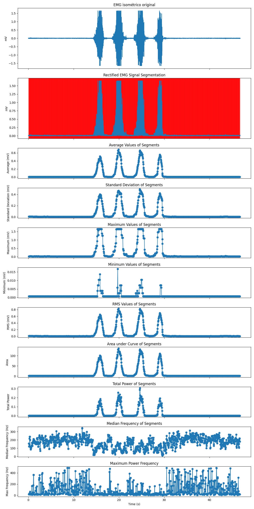
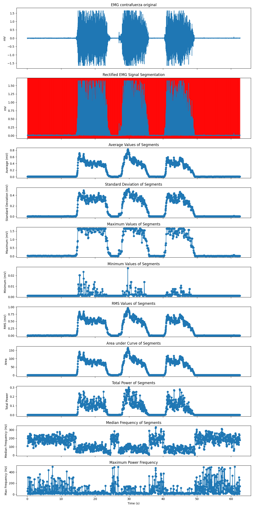

# Tratamiento de señal EMG
Lista de participantes:  
- Mantilla M., Ana Belen  
- Valdivia E., Erick Alexander   
- Flórez T., Armando Antonio  
- Taquiri D., Diego Alejandro

## Tabla de contenidos
1. [Introducción](https://github.com/diego-taquiri/ISB-equipo11/blob/main/Documentaci%C3%B3n/Laboratorio%2011/Procesamiento_EMG.md#introducci%C3%B3n)
2. [Objetivos específicos de la práctica](https://github.com/diego-taquiri/ISB-equipo11/blob/main/Documentaci%C3%B3n/Laboratorio%2011/Procesamiento_EMG.md#objetivos-espec%C3%ADficos-de-la-pr%C3%A1ctica)
3. [Materiales y métodos](https://github.com/diego-taquiri/ISB-equipo11/blob/main/Documentaci%C3%B3n/Laboratorio%2011/Procesamiento_EMG.md#materiales-y-m%C3%A9todos)
5. [Resultados](https://github.com/diego-taquiri/ISB-equipo11/blob/main/Documentaci%C3%B3n/Laboratorio%2011/Procesamiento_EMG.md#resultados)
6. [Discusión](https://github.com/diego-taquiri/ISB-equipo11/blob/main/Documentaci%C3%B3n/Laboratorio%2011/Procesamiento_EMG.md#discusi%C3%B3n)
7. [Bibliografía](https://github.com/diego-taquiri/ISB-equipo11/blob/main/Documentaci%C3%B3n/Laboratorio%2011/Procesamiento_EMG.md#bibliograf%C3%ADa)

### Introducción

 La electromiografía (EMG) se refiere a la señal eléctrica colectiva de los músculos, la cual está controlada por el sistema nervioso y se produce durante la contracción muscular. Esta representa las propiedades anatómicas y fisiológicas de los músculos; de hecho, una señal de EMG es la actividad eléctrica de las unidades motoras de un músculo, las cuales consisten en dos tipos: EMG superficial y EMG intramuscular. [1] En este laboratorio se estará trabajando con EMG superficial, el cual capta las señales mediante electrodos no invasivos y las reproduce, como en la figura 1. 

  

<b>Figura 1.</b> Señal EMG cruda [2].   

 Este tipo de señales se prefieren para obtener información sobre el tiempo o la intensidad de la activación muscular superficial y se consideran útiles como señales electrofisiológicas tanto en el campo médico como en el ingenieril. Para utilizar estas aplicaciones de manera efectiva, la adquisición precisa de la señal de EMG es un requisito previo; sin embargo, siempre que se registra una señal de EMG del músculo, varios tipos de ruidos la contaminan (equipos electrónicos y factores fisiológicos). Por lo tanto, analizar y clasificar las señales de EMG es muy difícil debido al patrón complicado de la EMG, especialmente cuando ocurre el movimiento. [1] Extraer ideas significativas de estas señales requiere la aplicación de técnicas avanzadas de reconocimiento de patrones y análisis de datos, donde la decodificación de señales de sEMG puede resumirse de la siguiente manera [2]: 

  

<b>Figura 2.</b> Arquitectura de clasificación de señales de sEMG. [3].   
  
#### Adquisición de señales

 A pesar de las características no estacionarias de las señales de sEMG, aún pueden ser detectadas utilizando electrodos de superficie, los cuales se clasifican según su tipo y densidad. El sensor utilizado para la adquisición de sEMG debe adherirse al teorema de Nyquist-Shannon, lo que garantiza una frecuencia de muestreo que sea al menos el doble de la frecuencia más alta de las señales de sEMG, lo que requiere una frecuencia de muestreo superior a 1000 Hz. [2]

#### Preprocesamiento

 El desafío con los datos de sEMG en bruto radica en el alto nivel de ruido capturado durante la adquisición de la señal. Principalmente, existen tres tipos de ruido en las señales de sEMG: ruido inherente de los componentes electrónicos, interferencia de frecuencia de potencia del sistema eléctrico y ruido originado por los electrodos. [2]  
  
- 
<b>Filtrado:</b> El filtrado es esencial para reducir los artefactos en las señales de sEMG. [2] Existen filtros de Wavelet, Respuesta Finita al Impulso (FIR) y filtros de Respuesta Infinita al Impulso (IIR) con diversas subclases (desvanecimiento de bordes de ventana), donde los especialistas pueden identificar configuraciones y coeficientes óptimos para adaptarse mejor a una señal que tiene un propósito específico. [4]  

- 
<b>Rectificación:</b> Dado que las señales de sEMG fluctúan entre valores positivos y negativos durante la contracción muscular, se abordan 2 enfoques comunes: rectificación de onda completa y de onda media, siendo la primera preferida debido a su capacidad para representar la señal de activación neural. [2] Todas las amplitudes negativas se convierten en amplitudes positivas porque, además de facilitar la lectura, hace que los parámetros de amplitud estándar como la media, el pico/máximo valor y el área se pueden aplicar a la curva (la EMG cruda tiene un valor medio de cero). [4]  

- 
<b>Normalización:</b> Como se muestra una variabilidad significativa entre individuos, la normalización de amplitud es esencial para comparar las señales entre diferentes sujetos, eliminando la variación en el índice de grasa corporal, la edad, la fatiga, el género y factores externos. La normalización implica dividir las señales de sEMG recopiladas por un valor de referencia de sEMG en condiciones idénticas, lo que facilita las comparaciones entre sujetos. [2]  

- 
<b>Segmentación:</b> Los datos muestreados se dividen en segmentos, donde el tamaño de estos debe ser lo suficientemente grande como para extraer adecuadamente características de cada uno y tener una mayor precisión de clasificación, pero su longitud también debe ser pequeña para evitar cualquier retraso computacional. Hay dos métodos predominantes: el método de ventanas adyacentes y el método de ventanas superpuestas. En el método adyacente, los datos se dividen en segmentos predefinidos y se extraen características de cada segmento; sin embargo, deja al procesador inactivo hasta la formación del siguiente segmento. Por otro lado, el método de ventanas superpuestas implica segmentos con solapamiento entre cada segmento y su predecesor, facilitando la extracción de características adicionales y produciendo mayor precisión de clasificación. [2]

#### Extracción de características 

 Si bien los clasificadores pueden entrenarse utilizando señales en bruto preprocesadas, generalmente se logra una mejor precisión extrayendo características de estas señales. Esto no solo mejora el rendimiento del clasificador, sino que también reduce la dimensionalidad, simplificando el procesamiento y la clasificación posteriores. [2]  Hasta ahora, ningún estudio ha identificado qué tipos de características pueden expresar completamente las propiedades matemáticas de las señales de sEMG. Si se seleccionan demasiadas características, se aumentará el cálculo y la complejidad del clasificador, y la eficiencia de reconocimiento se reducirá. Si se seleccionan demasiado pocas características, la información contenida en la señal de EMG se perderá y no contribuirá a la clasificación en los pasos de identificación subsiguientes. [5]  
  
- 
<b>Características en el dominio del tiempo:</b> Se evalúan en función de las variaciones de amplitud de la señal a lo largo del tiempo, eliminando la necesidad de transformaciones adicionales y beneficiándose de su simplicidad y bajos requisitos de recursos computacionales. [2]  

  

<b>Figura 3.</b> Resumen de las características en el dominio del tiempo. [2].   
  
- 
<b>Características en el dominio de la frecuencia:</b> No pueden derivarse directamente de los datos en bruto y se obtienen aplicando la transformada de Fourier a la señal. Estas características abarcan la densidad espectral de potencia de la señal. [2]  

  

<b>Figura 4.</b> Resumen de las características en el dominio de la frequencia [2].   

- 
<b>Características en el dominio tiempo-frecuencia:</b> La transformada tiempo-frecuencia (TFD) combina información tanto de tiempo como de frecuencia, permitiendo la observación de diferentes componentes de frecuencia en distintos intervalos de tiempo. Esta técnica es especialmente valiosa para detectar componentes localizados, transitorios o intermitentes que pueden pasarse por alto con métodos espectrales tradicionales como la Transformada de Fourier (FFT). Se dispone de varios métodos para realizar la descomposición de señales en el plano tiempo-frecuencia, como la transformada continua de wavelet (CWT) y la transformada discreta de wavelet (DWT), así como otras técnicas como la distribución de Choi-Williams (CWD), la transformada de Fourier de tiempo corto (STFT) y la transformada de Wigner-Ville (WVT). Entre estos, la transformada de wavelet (WT) se destaca por su versatilidad, ya que no se limita a funciones sinusoidales y puede acomodar una amplia variedad de formas de onda, siempre que cumplan con ciertos criterios predefinidos. [2]  

  

<b>Figura 5.</b> Resumen de las características en el dominio del tiempo-frequencia. [2].   
  
#### Clasificación y evaluación

 Hay varios enfoques de aprendizaje automático y aprendizaje profundo para decodificar las señales de sEMG, pero que no serán abarcados este laboratorio. [2] En el campo del diagnóstico clínico y la biomedicina, el análisis de señales de EMG con metodologías potentes y avanzadas se está convirtiendo cada vez más en una herramienta necesaria para los proveedores de atención médica. [1] La posibilidad de estudiar la activación de los músculos esqueléticos, mediante el registro de los potenciales eléctricos producidos durante las contracciones musculares, es de particular relevancia en la ciencia deportiva y la medicina de rehabilitación. [6]

### Objetivos específicos de la práctica
- 
 Adquirir una comprensión sólida de la Electromiografía (EMG) y las técnicas de procesamiento de señales relacionadas.
- 
 Identificar y elegir el filtro más apropiado para cada señal sEMG, asegurando una reducción efectiva del ruido sin comprometer la integridad de los datos.
- 
 Reconocer la importancia fundamental de la segmentación de señales en el análisis eficaz de la EMG y valorar su papel en la obtención de resultados precisos.
- 
 Desarrollar competencias para extraer características relevantes de las señales de EMG en diferentes dominios para una interpretación más completa de los datos.
- 
 Ejecutar las etapas del tratamiento de la señal EMG de manera coherente y precisa en dos señales de un mismo individuo realizando diferentes actividades, garantizando la comparabilidad y fiabilidad de los resultados obtenidos.
  
### Materiales y métodos

#### Adquisición
#### Filtrado 
#### Rectificación
#### Segmentación
#### Extracción de caracteristicas

### Resultados

| EMG Isometrico        | EMG contrafuerza                                                        |
|--------------|---------------------------------------------------------------|
|         |                     |

### Discusión

 El análisis de su señal EMG rectificada revela características interesantes asociadas con la contracción muscular:
  
•	Los valores medios rectificados de EMG (0,4 mV - 0,8 mV) dentro de los segmentos de contracción son más altos en comparación con el estado de reposo (que se supone que es antes/después de la contracción con valores alrededor de 0,02 mV). Esto se alinea con la investigación de Duran et al., 2013 [7] que informaron un aumento de la amplitud de EMG durante la contracción muscular debido a mayores tasas de disparo de unidades motoras.
  
•	La desviación estándar (0,2 mV - 0,4 mV) también aumenta durante la contracción. Esto refleja una mayor variabilidad en los patrones de reclutamiento de fibras musculares.
  
•	La presencia de valores máximos que exceden el rango rectificado (1,5 mV) sugiere posibles artefactos o eventos de alta amplitud de corta duración. La actividad muscular puede generar picos que exceden los niveles basales, pero estos deben ser transitorios y no dominar la señal. Considere técnicas de filtrado para abordar posibles artefactos.
  
•	Los valores RMS (root mean square) que van desde 0,5 mV hasta un máximo de 1 mV durante la contracción indican una mayor actividad muscular general en comparación con el estado de reposo con un RMS potencialmente más bajo. Esto se alinea con el concepto de RMS como medida de la potencia de la señal, que aumenta con la activación muscular como podemos ver en el estudio realizado por Hermens et al., 2000 [8].
  
•	El área bajo la curva (AUC) también respalda esta observación. Los valores más altos de AUC (50 mV - 150 mV) durante la contracción sugieren una mayor actividad eléctrica acumulativa en comparación con el estado de reposo.
  
•	La disminución observada en la frecuencia mediana (alrededor de 100 Hz) durante los segmentos de contracción en comparación con el estado de reposo (alrededor de 200 Hz) es un hallazgo interesante. Esto podría deberse al reclutamiento de fibras musculares más grandes y de contracción lenta durante contracciones sostenidas [9]. Además, la fatiga muscular también puede contribuir a una disminución de la frecuencia mediana.
  
•	La presencia de frecuencias máximas más altas fuera de los segmentos de contracción sugiere la posibilidad de activaciones musculares breves y de alta frecuencia asociadas con el espasmo muscular o el reclutamiento inicial.

El análisis respalda los cambios esperados en la señal EMG durante la contracción muscular. El aumento de la amplitud (media, desviación estándar, RMS, AUC), la disminución de la frecuencia mediana y los potenciales ráfagas de alta frecuencia apuntan hacia una mayor actividad de las unidades motoras durante la contracción.

### Bibliografía

 [1] R. Chowdhury, M. Reaz, M. Ali, A. Bakar, K. Chellappan, y T. Chang, “Surface electromyography signal processing and classification techniques”, Sensors (Basel), vol. 13, núm. 9, pp. 12431–12466, 2013.

 [2] A. M. Moslhi, H. H. Aly, y M. ElMessiery, “The impact of feature extraction on classification accuracy examined by employing a Signal Transformer to classify hand gestures using surface electromyography signals”, Sensors (Basel), vol. 24, núm. 4, p. 1259, 2024.

 [3] S. M. S. Moctar, I. Rida, y S. Boudaoud, “Time-domain features for sEMG signal classification: A brief survey”, Hal.science. [En línea]. Disponible en: https://hal.science/hal-04199535/document.

 [4] A. P. I. to Electromyography, “The ABC of EMG”, Noraxon.com. [En línea]. Disponible en: https://www.noraxon.com/wp-content/uploads/2014/12/ABC-EMG-ISBN.pdf.

 [5] Y. Wu, X. Hu, Z. Wang, J. Wen, J. Kan, y W. Li, “Exploration of feature extraction methods and dimension for sEMG signal classification”, Appl. Sci. (Basel), vol. 9, núm. 24, p. 5343, 2019.

 [6] M. A. Cavalcanti Garcia y T. M. M. Vieira, “Surface electromyography: Why, when and how to use it”, Rev. Andal. Med. Deport., vol. 4, núm. 1, pp. 17–28, 2011.

[7] Durán Acevedo, Cristhian Manuel, & Jaimes Mogollón, Aylen Lisset. (2013). Optimización y clasificación de señales EMG a través de métodos de reconocimiento de patrones. Iteckne, 10(1), 67-76. Retrieved May 25, 2024, from http://www.scielo.org.co/scielo.php?script=sci_arttext&pid=S1692-17982013000100009&lng=en&tlng=es.

[8] Hermens HJ, Freriks B, Disselhorst-Klug C, Rau G. Development of recommendations for SEMG sensors and sensor placement procedures. J Electromyogr Kinesiol. 2000 Oct;10(5):361-74. doi: 10.1016/s1050-6411(00)00027-4. PMID: 11018445.

[9] Wakeling JM, Uehli K, Rozitis AI. Muscle fibre recruitment can respond to the mechanics of the muscle contraction. J R Soc Interface. 2006 Aug 22;3(9):533-44. doi: 10.1098/rsif.2006.0113. PMID: 16849250; PMCID: PMC1664648.
