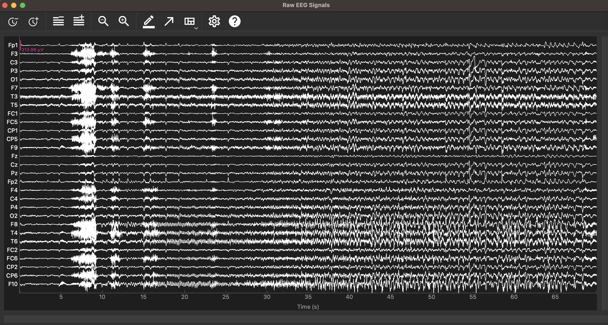
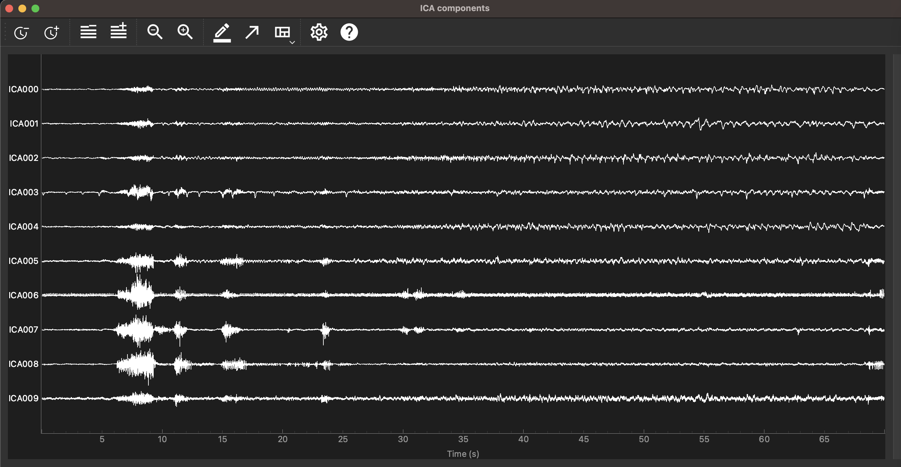
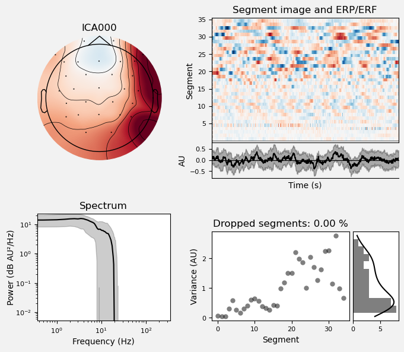
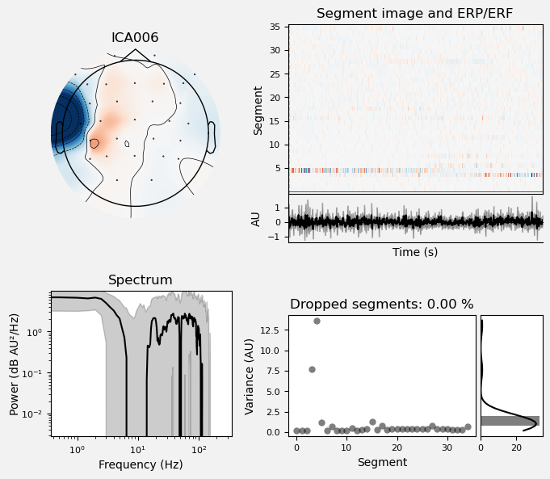
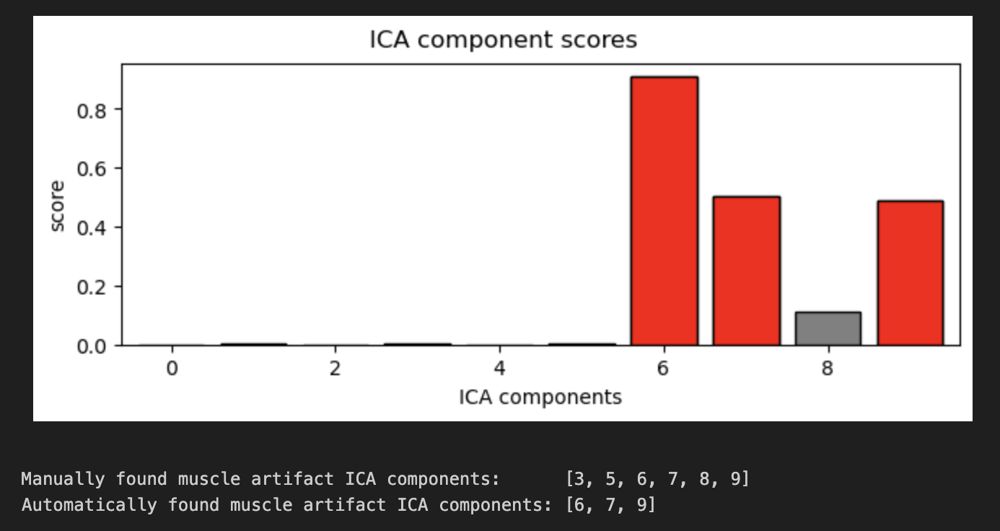
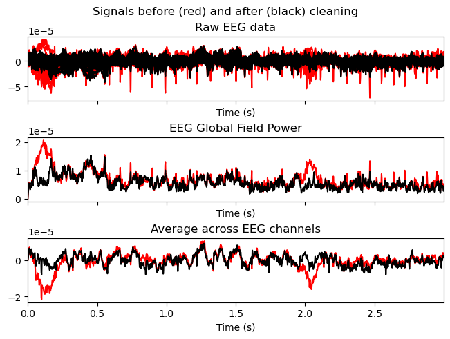

# Tratamiento de señal EEG
Lista de participantes:  
- Mantilla M., Ana Belen  
- Valdivia E., Erick Alexander   
- Flórez T., Armando Antonio  
- Taquiri D., Diego Alejandro

## Tabla de contenidos
1. [Introducción](https://github.com/diego-taquiri/ISB-equipo11/blob/main/Documentaci%C3%B3n/Laboratorio%2013/Procesamiento_EEG.md#introducci%C3%B3n)
2. [Objetivos específicos de la práctica](https://github.com/diego-taquiri/ISB-equipo11/blob/main/Documentaci%C3%B3n/Laboratorio%2013/Procesamiento_EEG.md#objetivos-espec%C3%ADficos-de-la-pr%C3%A1ctica)
3. [Materiales y métodos](https://github.com/diego-taquiri/ISB-equipo11/blob/main/Documentaci%C3%B3n/Laboratorio%2013/Procesamiento_EEG.md#materiales-y-m%C3%A9todos)
5. [Resultados](https://github.com/diego-taquiri/ISB-equipo11/blob/main/Documentaci%C3%B3n/Laboratorio%2013/Procesamiento_EEG.md#resultados)
6. [Discusión](https://github.com/diego-taquiri/ISB-equipo11/blob/main/Documentaci%C3%B3n/Laboratorio%2013/Procesamiento_EEG.md#discusi%C3%B3n)
7. [Bibliografía](https://github.com/diego-taquiri/ISB-equipo11/blob/main/Documentaci%C3%B3n/Laboratorio%2013/Procesamiento_EEG.md#bibliograf%C3%ADa)

### Introducción
<p align="justify"> La electroencefalografía (EEG) es un método de imagenología cerebral no invasivo en el que se colocan electrodos sobre el cuero cabelludo para registrar la actividad eléctrica del cerebro. Este proceso permite a los investigadores medir y estudiar las señales eléctricas generadas por el cerebro, proporcionando así información crucial sobre su funcionamiento. Esta técnica es fundamental para identificar trastornos neurológicos diversos y para investigar procesos cognitivos como la percepción, la atención y la memoria. [1] Existen cinco ondas cerebrales principales que se distinguen por sus diferentes rangos de frecuencia. Estas bandas de frecuencia, de bajas a altas respectivamente, se denominan alpha (α), theta (θ), beta (β), delta (δ) y gamma (γ). [2]

<p align="center">
<br> 
<p align="center"><b>Figura 1.</b> Ritmos cerebrales dominantes típicos. La onda delta se observa en bebés y adultos durante el sueño, la onda theta en niños y adultos durante el sueño, la onda alfa se detecta en la región occipital del cerebro cuando no hay atención, y la onda beta aparece frontal y parietalmente con baja amplitud. [2] <br> 
  
<p align="justify"> Para identificar y analizar de manera precisa las señales de EEG, es necesario tener un profundo conocimiento de sus propiedades complejas y teóricas, así como realizar la extracción de características relevantes. Sin embargo, las señales de EEG presentan desafíos significativos debido a sus características únicas. Estos desafíos incluyen la susceptibilidad al ruido, su naturaleza no lineal y la falta de conformidad con una distribución normal, además de factores individuales como la edad, la psicología y el entorno. Las propiedades distintivas de las señales de EEG representan un desafío para extraer información relevante sobre tareas específicas directamente de ellas. Por lo tanto, es crucial desarrollar diversas metodologías para el análisis de estas señales e investigar técnicas de aprendizaje automático para mejorar la comprensión de las señales de EEG. [1]

<p align="justify"> En general, el procesamiento de señales EEG tiene como objetivo traducir las señales EEG crudas en la clase de estas señales. Esta traducción generalmente se logra utilizando un enfoque de reconocimiento de patrones, cuyos pasos se pueden observar en la siguiente imagen. [3]

<p align="center">
<br> 
<p align="center"><b>Figura 2.</b> El análisis de señales EEG implica cuatro etapas: adquisición, eliminación de ruido, ingeniería de características y clasificación. [1] <br> 
  
<p align="justify"> La adquisición de la señal se suele realizar según ha sido estipulado por La Federación Internacional de Sociedades de Electroencefalografía y Neurofisiología Clínica, quien ha recomendado un ajuste convencional de electrodos (también llamado 10-20) para 21 electrodos (excluyendo los electrodos de lóbulo de la oreja). [2] Para iniciar con el tratamiento, después de la adquisición, se realiza un pipeline de filtrado y preprocesamiento (normalización y alineación), el cual es un conjunto de métodos aplicados a grabaciones crudas de EEG, destinados a preparar las señales para un análisis posterior y más específico. Puede incluir varios pasos en los que existen diferentes opciones, donde la selección de los algoritmos y herramientas "más apropiados" no es directa. [4] Esto es importante debido a lo siguiente [5]:
  
1. <p align="justify"> Las señales recogidas desde el cuero cabelludo no necesariamente son una representación precisa de las señales que provienen del cerebro.
2. <p align="justify"> Los datos de EEG contienen mucho ruido que puede ocultar señales de EEG más débiles.
3. <p align="justify"> Artefactos como parpadeos o movimientos musculares pueden contaminar los datos y distorsionar la imagen.
4. <p align="justify"> Queremos separar las señales neurales relevantes de la actividad aleatoria que ocurre durante las grabaciones de EEG.

<p align="justify"> Seguido a ello se tienen 2 pasos principales [3]:
  
- <p align="justify"> Extracción de características: Tiene como objetivo describir las señales EEG mediante idealmente unos pocos valores relevantes llamados "características", las cuales deben capturar la información incrustada en las señales EEG que es relevante para describir los estados mentales a identificar, mientras se rechaza el ruido y otra información no relevante. Todas las características extraídas generalmente se organizan en un vector conocido como vector de características.
  
- <p align="justify"> Clasificación: Asigna una clase a un conjunto de características extraído de las señales, la cual corresponde al tipo de investigación identificado. Este paso también puede ser denominado "traducción de características" y a sus algoritmos se les conoce como "clasificadores".

<p align="justify"> Las señales EEG pueden ser procesadas en dominios de tiempo, frecuencia o espaciales, ofreciendo medios multidimensionales para interpretar las actividades cerebrales. Además de proporcionar información invaluable, las señales EEG tienen la ventaja de capturar patrones neurales complejos a alta velocidad. Como método confiable, portátil y no invasivo para medir la actividad eléctrica en el cerebro, el EEG es una metodología central para la investigación asequible y práctica, así como una herramienta prometedora en la atención clínica. [6]

### Objetivos específicos de la práctica
- <p align="justify">Aplicar técnicas avanzadas de filtrado para reducir el ruido y eliminar artefactos en las señales EEG, asegurando que la señal esté limpia y lista para un análisis más detallado.
- <p align="justify">Normalizar y alinear las señales EEG durante el preprocesamiento para garantizar la consistencia y comparabilidad entre las sesiones o sujetos, preparando las señales para una extracción eficaz de características.
- <p align="justify">Implementar métodos de extracción de características utilizando análisis Wavelet (continuo o discreto) para identificar las características más informativas y relevantes de las señales EEG que pueden estar relacionadas con estados mentales específicos o respuestas cognitivas.
- <p align="justify">Desarrollar y aplicar técnicas de feature engineering para optimizar las características extraídas, mejorando así la precisión y eficacia de los modelos de machine learning utilizados en la clasificación de patrones de actividad cerebral.
- <p align="justify">Explorar el uso de MNE-Python para integrar y analizar datos desde múltiples dominios (tiempo, frecuencia, espacio), facilitando una comprensión holística de las dinámicas cerebrales.

### Materiales y métodos
<p align="justify"> El laboratorio se enfoca en el análisis avanzado de datos neurofisiológicos humanos utilizando herramientas modernas y metodologías innovadoras. En particular, utilizamos el paquete de código abierto en Python conocido como MNE-Python. Esta herramienta permite explorar, visualizar y analizar una variedad de datos neurofisiológicos, incluyendo MEG, EEG, sEEG, ECoG, NIRS, entre otros. [7] MNE-Python no solo facilita la manipulación y procesamiento de grandes volúmenes de datos, sino que también ofrece herramientas robustas para la extracción de características, el análisis espectral y la clasificación de patrones. El objetivo de esta herramienta es implementar y proporcionar un conjunto de algoritmos que permitan a los usuarios ensamblar flujos completos de análisis de datos que abarquen la mayoría de las fases del procesamiento de datos M/EEG. [8]

#### Adquisición de datos
Para la adquisición de datos EEG, se utilizó la Siena Scalp EEG Database de PhysioNet, que contiene registros de 14 pacientes (9 hombres, 5 mujeres, edades 20-71) con epilepsia. Las señales se obtuvieron utilizando amplificadores EB Neuro y Natus Quantum LTM, con electrodos de copa reutilizables siguiendo el sistema internacional 10-20, y un total de 32 canales EEG con una frecuencia de muestreo de 512 Hz. Los datos, organizados en formato EDF, incluyen episodios epilépticos clasificados según los criterios de la Liga Internacional Contra la Epilepsia y se almacenan en carpetas individuales para cada paciente. Además, los registros incluyen señales de EKG y detalles sobre la lateralización de los episodios. Los pacientes dieron su consentimiento informado y la aprobación ética fue otorgada por la Universidad de Siena [9].

#### Preprocesamiento

Para el preprocesamiento de los datos EEG, seleccionamos el archivo correspondiente al primer paciente (PN00-1.edf). Este archivo contiene un episodio de epilepsia que recortamos para analizar específicamente la señal de interés. Recortamos la señal para tomar solo el episodio epiléptico que dura 1 minuto y 10 segundos.

```python
# Define the path to your .edf file
edf_file_path = 'PN00-1.edf'  # Replace with the actual file name if it's in the same directory

# Load the EDF file
raw = mne.io.read_raw_edf(edf_file_path, preload=True)

# Crop the raw data to take only the epilepsy episode
raw.crop(tmin=1143, tmax=1213)
```

Luego, seleccionamos solo los canales EEG, excluyendo cualquier canal marcado como "malo". También renombramos los canales según el sistema estándar 10-20 para asegurar la consistencia y compatibilidad con las herramientas de análisis EEG.

Para la digitalización, agregamos las coordenadas espaciales a cada electrodo utilizando el montaje estándar 10-20, lo que es crucial para los análisis espaciales posteriores. Además, excluimos ciertos canales que no son relevantes para el análisis EEG, como aquellos utilizados para monitoreo cardíaco y otros propósitos auxiliares.

```python
# Drop non-brain channels which are not used in EEG brain signal analysis
raw.drop_channels(['ECG', 'SPO2', 'HR', '1', '2', 'MK'])

# Define a standard montage (10-20 system)
montage = mne.channels.make_standard_montage('standard_1020')
```

#### Filtrado

Para mejorar la calidad de las señales EEG, se realizó un proceso de filtrado y eliminación de artefactos. Inicialmente, se aplicaron filtros notch para eliminar el ruido de la línea de alimentación a 50 Hz y sus armónicos, mejorando la precisión del análisis posterior.
```python

# Apply notch filter to remove power line noise at 50 Hz
raw.notch_filter(freqs=50.0, notch_widths=1.0)

# Apply notch filter to remove power line noise at 150.0 Hz
raw.notch_filter(freqs=150.0, notch_widths=1.0)
```
Posteriormente, se aplicó un filtro pasa-altas con una frecuencia de corte de 1 Hz para eliminar componentes de baja frecuencia.


```python
# ICA works best with a highpass filter applied
raw.filter(l_freq=1.0, h_freq=None)
```

Posteriormente, se empleó un Análisis de Componentes Independientes (ICA) utilizando 10 componentes. Este número de componentes fue ajustado de acuerdo al número de canales disponibles, que son 32.

```python
ica = mne.preprocessing.ICA(
    n_components=10, method="picard", max_iter="auto", random_state=97
)
ica.fit(raw)
```
Para identificar manualmente los artefactos, se plotearon las propiedades de las componentes ICA seleccionadas. Inicialmente, se visualizaron las componentes para identificar señales sospechosas de ser artefactos, como las señales musculares.

```python
idx = [0, 1, 2, 4, 9]
ica.plot_properties(raw, picks=idx, log_scale=True)

artifacts_idx = [3,5,6,7,8]
ica.plot_properties(raw, picks=artifacts_idx, log_scale=True)
```
Adicionalmente, se utilizó un algoritmo automático para detectar artefactos musculares. Los índices de las componentes ICA identificadas automáticamente como artefactos fueron comparados con los manualmente seleccionados.

```python
muscle_idx_auto, scores = ica.find_bads_muscle(raw)
ica.plot_scores(scores, exclude=muscle_idx_auto)
print(
    f"Manually found muscle artifact ICA components:      {artifacts_idx}\n"
    f"Automatically found muscle artifact ICA components: {muscle_idx_auto}"
)
```
Una vez identificados los artefactos, se aplicó el ICA para eliminar estos componentes y reconstruir la señal EEG.
```python
ica.apply(raw)
ica.plot_overlay(raw, exclude=artifacts_idx)
```
Finalmente, se compararon las señales originales y filtradas para verificar la efectividad de la eliminación de artefactos, asegurando que la señal reconstruida estuviera libre de las interferencias detectadas.

#### Feature extraction

#### Feature engineering

### Resultados
<p align="center">
<br>
<p align="center"><b>Figura 3.</b> Ploteo de la señal de electroencefalograma (EEG) cruda del paciente, mostrando la extracción del episodio de epilepsia a través de los 29 canales.</p>

<p align="center">
<br>
<p align="center"><b>Figura 4.</b> Ploteo de los 10 componentes ICA (Análisis de Componentes Independientes) de la señal EEG del paciente, mostrando el resultado del filtrado de la señal.</p>

<p align="center">
<br>
<p align="center"><b>Figura 5.</b> Ploteo del componente ICA 0 de la señal EEG. Este componente muestra un patrón focalizado en el hemisferio derecho, lo que indica una señal profunda relacionada con la lateralización del hemisferio derecho en el paciente con epilepsia.</p>

<p align="center">
<br>
<p align="center"><b>Figura 6.</b> Ploteo del componente ICA 6 de la señal EEG. Este componente representa un artefacto que ha sido identificado y eliminado mediante el análisis ICA, permitiendo una señal más limpia.</p>

<p align="center">
<br>
<p align="center"><b>Figura 7.</b> Identificación de artefactos en la señal EEG. Los artefactos identificados automáticamente como de músculo son los componentes 6, 7 y 9. Además, se muestran otros artefactos identificados manualmente.</p>

<p align="center">
<br>
<p align="center"><b>Figura 8.</b> Reconstrucción de la señal EEG antes (en rojo) y después (en negro) de la limpieza. La señal después de la limpieza muestra la eliminación de los componentes ICA que eran artefactos, resultando en una señal más pura.</p>

### Discusión

### Bibliografía
<p align="justify"> [1] A. Chaddad, Y. Wu, R. Kateb, y A. Bouridane, “Electroencephalography signal processing: A comprehensive review and analysis of methods and techniques”, Sensors (Basel), vol. 23, núm. 14, p. 6434, 2023.
<p align="justify"> [2] S. Sanei y J. A. Chambers, EEG signal processing. Wiley, 2007.
<p align="justify"> [3] F. Lotte, “A tutorial on EEG signal-processing techniques for mental-state recognition in brain–computer interfaces”, en Guide to Brain-Computer Music Interfacing, London: Springer London, 2014, pp. 133–161.
<p align="justify"> [4] S. Coelli et al., “Selecting methods for a modular EEG pre-processing pipeline: An objective comparison”, Biomed. Signal Process. Control, vol. 90, núm. 105830, p. 105830, 2024.
<p align="justify"> [5] “Introduction to EEG-preprocessing”, Github.io. [En línea]. Disponible en: https://g0rella.github.io/gorella_mwn/preprocessing_eeg.html.
<p align="justify"> [6] Y. Tran, EEG signal processing for biomedical applications. MDPI, 2023.
<p align="justify"> [7] E. Larson et al., MNE-Python. Zenodo, 2024.
<p align="justify"> [8] A. Gramfort, “MEG and EEG data analysis with MNE-Python”, Front. Neurosci., vol. 7, 2013.

<p align="justify"> [9] Detti P. Siena Scalp EEG Database (version 1.0.0). PhysioNet. 2020. Available from: https://doi.org/10.13026/5d4a-j060.
