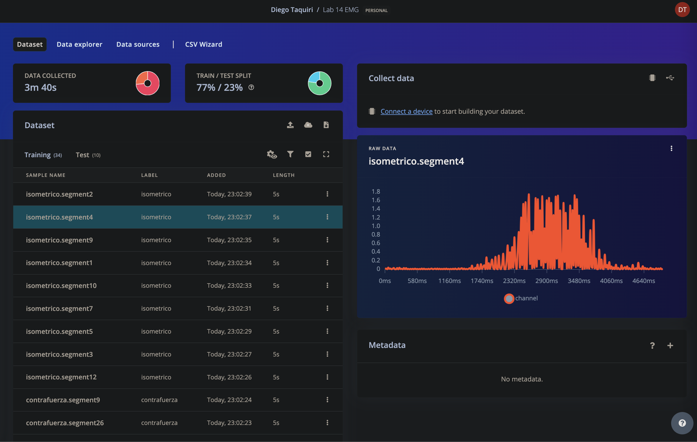
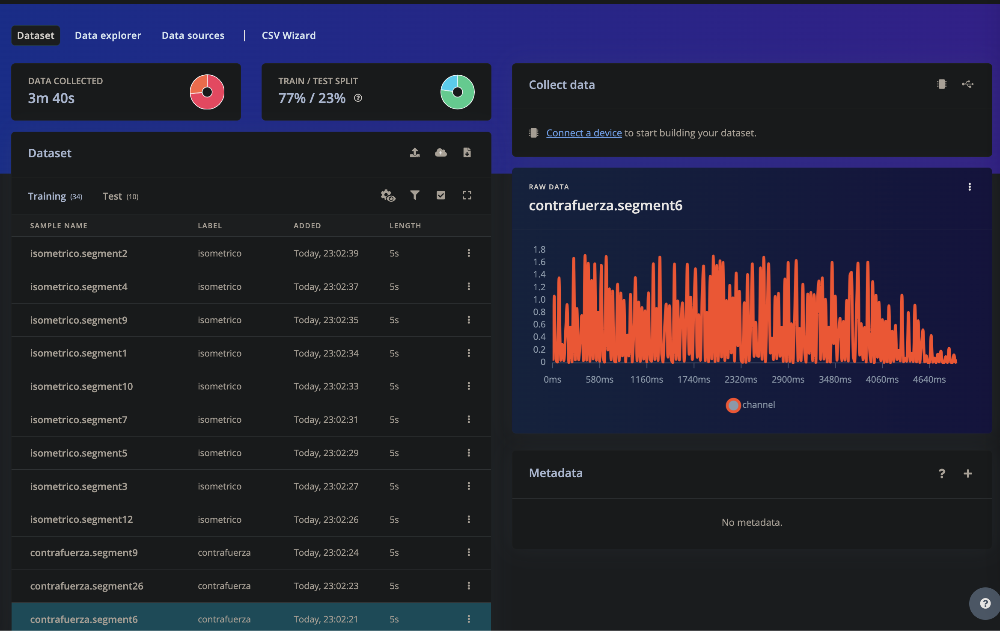
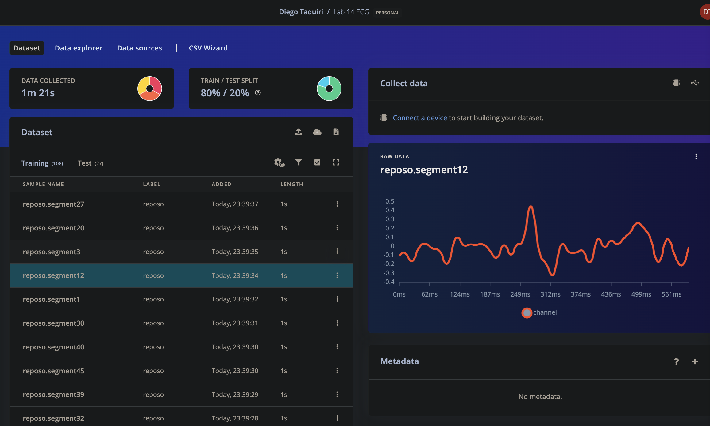
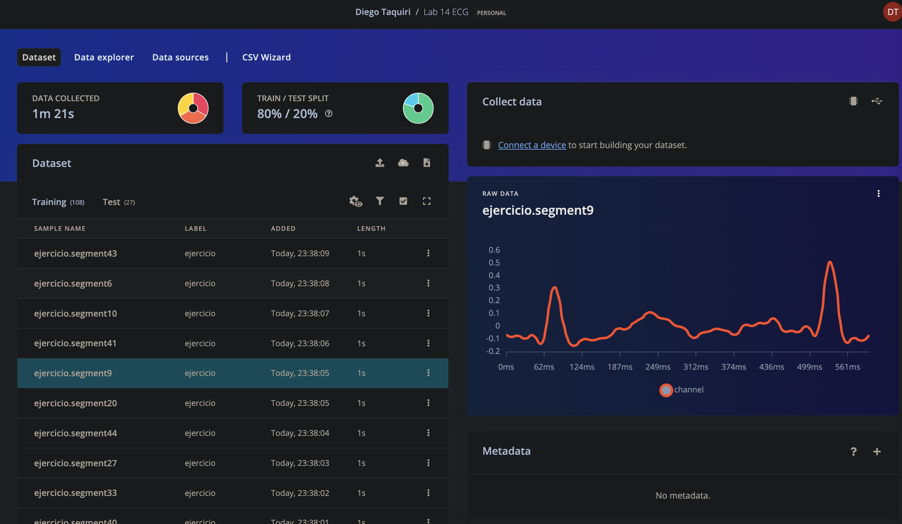
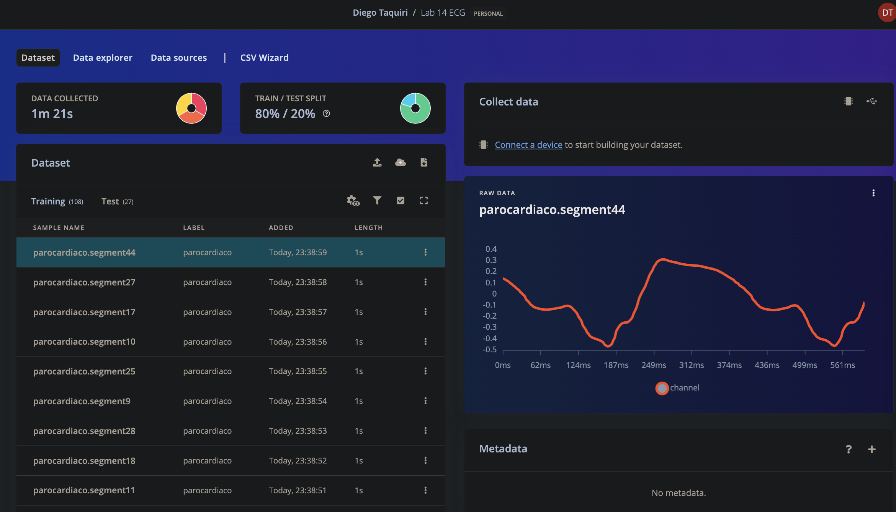

Link de Edge Impulse EMG: https://studio.edgeimpulse.com/public/431587/live

Para procesar la señal de electromiograma (EMG) obtenida con Arduino, primero se convirtieron los datos de bits a milivoltios y se centraron alrededor de cero. Luego, se eliminaron las porciones iniciales y finales sin actividad muscular, utilizando los límites de recorte definidos en el código (14000 a 50000 muestras). La señal centrada fue rectificada para asegurar valores positivos. Posteriormente, se aplicó un filtro FIR con una ventana de Bartlett para reducir el ruido. Finalmente, se realizó una segmentación de la señal filtrada y rectificada, utilizando ventanas solapadas de 5000 milisegundos con incrementos de 1000 milisegundos, considerando una tasa de muestreo de 1000 Hz. Los segmentos resultantes fueron cargados en Edge Impulse para su análisis.

  

<b>Figura 1.</b> Señal EMG - Isometrico.

  

<b>Figura 2.</b> Señal EMG - Contrafuerza.

Link de Edge Impulse ECG: https://studio.edgeimpulse.com/public/431598/live

Para procesar la señal de electrocardiograma (ECG) obtenida con Arduino, primero se convirtieron los datos de bits a milivoltios. Luego, se seleccionó una porción específica de la señal entre 50 y 55 segundos. La señal seleccionada se filtró utilizando un filtro pasabandas digital con frecuencias de corte de 0.5 Hz y 43 Hz. Posteriormente, se aplicó un filtro FIR y un filtro de promedio móvil para suavizar la señal. Después de estos procesos de filtrado, se segmentó la señal suavizada en ventanas solapadas de 600 milisegundos con incrementos de 100 milisegundos, considerando una tasa de muestreo de 1000 Hz. Los segmentos resultantes fueron los que se cargaron en H-Impulse para su análisis.

  

<b>Figura 3.</b> Señal ECG - Reposo.

  

<b>Figura 4.</b> Señal ECG - Ejercicio.

  

<b>Figura 5.</b> Señal ECG - Paro cardiaco.
