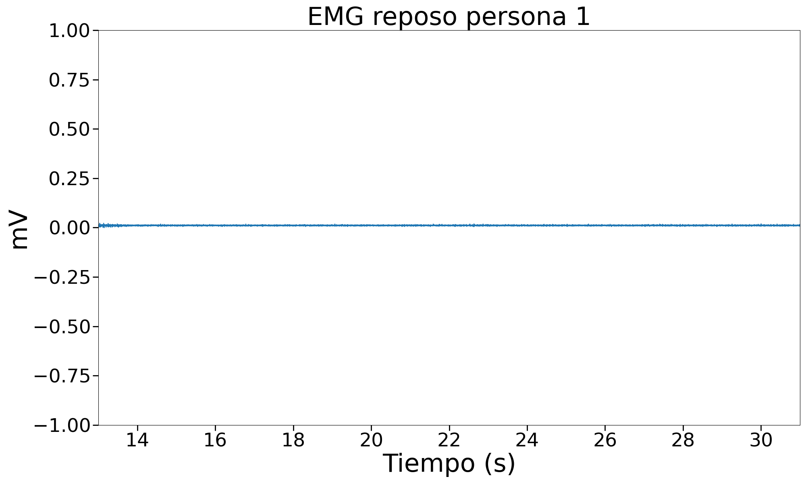
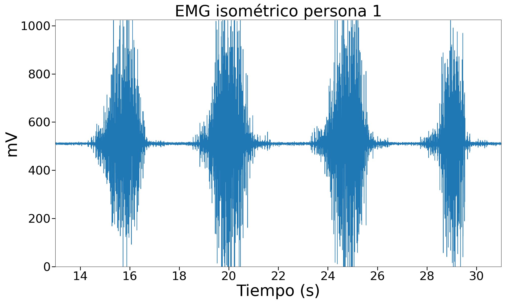
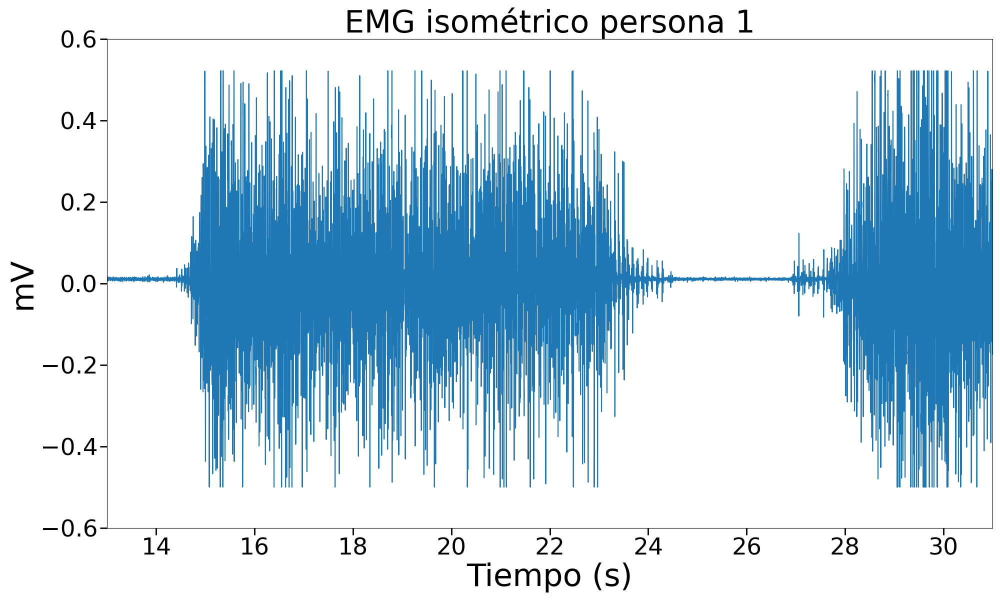
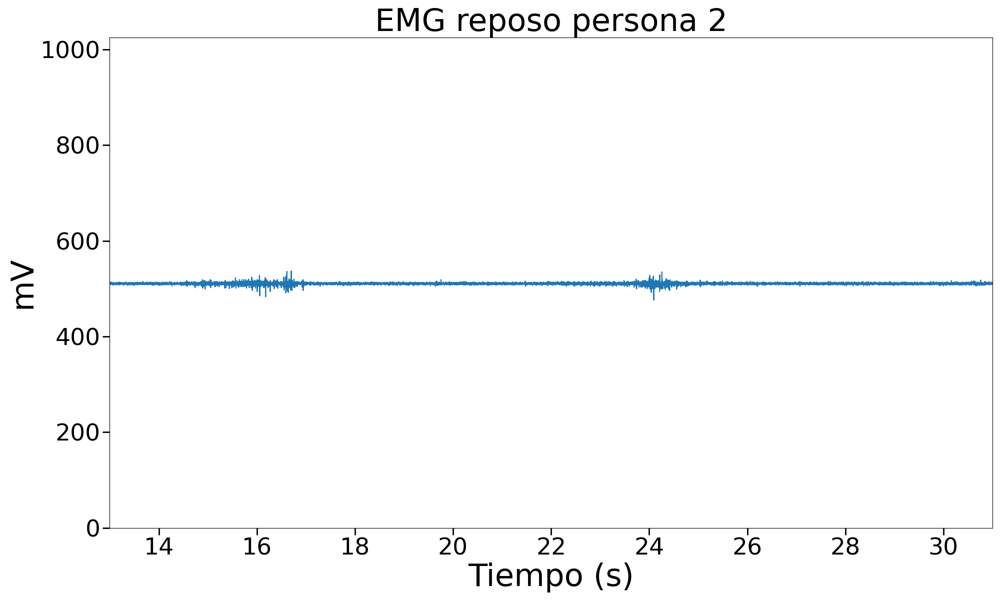
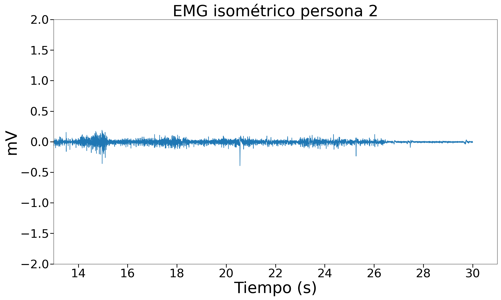

# Uso de BiTalino para EMG
Lista de participantes:  
-Mantilla M., Ana Belen  
-Valdivia E., Erick Alexander   
-Flórez T., Armando Antonio  
-Taquiri D., Diego Alejandro  

## Tabla de contenidos
1. [Objetivos específicos de la práctica](https://github.com/diego-taquiri/ISB-equipo11/tree/main/Documentaci%C3%B3n/Laboratorio%203#objetivos-espec%C3%ADficos-de-la-pr%C3%A1ctica)
2. [Materiales y métodos](https://github.com/diego-taquiri/ISB-equipo11/blob/main/Documentaci%C3%B3n/Laboratorio%203/README.md#materiales-y-m%C3%A9todos)
3. [Resultados](https://github.com/diego-taquiri/ISB-equipo11/blob/main/Documentaci%C3%B3n/Laboratorio%203/README.md#resultados)
   - [Archivo de los datos de la señal ploteada](https://github.com/diego-taquiri/ISB-equipo11/tree/main/Documentaci%C3%B3n/Laboratorio%203#archivo-de-los-datos-de-la-se%C3%B1al-ploteada)
   - [Ploteo de las señales en Python](https://github.com/diego-taquiri/ISB-equipo11/tree/main/Documentaci%C3%B3n/Laboratorio%203#ploteo-de-las-se%C3%B1ales-en-python)

### Objetivos específicos de la práctica
- Adquirir señales biomédicas de EMG.
- Hacer una correcta configuración de BiTalino.
- Extraer la información de las señales EMG del software OpenSignals (r)evolution.

### Materiales y métodos

Se realizó la medición de EMG de acuerdo a las instrucciones de la guía experimental de BITalino sobre electromiografía. La medición se realizó utilizando un cable de electrodo de tres derivaciones conectado al terminal del BITalino correspondiente a EMG (Figura 1).   

  
Figura 1. Conexiones de cable de electrodo en BITalino.   

Los electrodos positivo y negativo se colocaron en el tercio medio del brazo, en la confluencia de los brazos corto y largo del bíceps braquial a una distancia de 2 centímetros uno de otro, mientras que el electrodo de tierra se colocó en el tercio proximal del antebrazo en la zona correspondiente al olécranon del cúbito. Las posiciones pueden observarse en la figura 2.   

   

      

    
    

Figura 2. (a) Posicionamiento de electrodos en primer estudio y (b) Posicionamiento de electrodos en segundo estudio.    

El protocolo seguido fue el de la guía experimental de BITalino. Se evaluaron tres situaciones. Una primera correspondiente a reposo del grupo muscular, una segunda correspondiente a la flexión del antebrazo sin resistencia y una tercera correspondiente a la flexión del antebrazo con resistencia al movimiento. Este estudio se realizó a dos participantes en igualdad de condiciones, tanto en posicionamiento de electrodos, como movimientos realizados; esto con el objetivo de realizar la comparación de las señales obtenidas.

### Resultados

Se realizó la evaluación de las tres condiciones planteadas en el primer participante; sin embargo, solo se realizaron las condiciones de reposo y contracción sin resistencia en el segundo participante. Se pudieron apreciar patrones distintos en la amplitud de la señal EMG de acuerdo al movimiento realizado.  
   

<b>Señal del músculo en reposo:</b> En ambos casos se observa una señal casi aplanada con una muy leve actividad eléctrica visible, la cual puede corresponder a ruido en la señal o a la actividad muscular que proporciona el tono muscular. No hay mayores diferencias entre ambos participantes. Las señales de contracción en ambos participantes se observan en los siguientes videos (dar click en las imágenes).   

[
](https://youtu.be/Z3UT4b5ZMPE)

Video 1. Señal de sEMG de bíceps braquial en reposo del Participante 1. (a) Conexiones electrodos-cuerpo y (b) señal ploteada.  

Video 2. Señal de sEMG de bíceps braquial en reposo del Participante 2. (a) Conexiones electrodos-cuerpo y (b) señal ploteada.  
   

<b>Señal del músculo en flexión:</b> Se observa el reclutamiento de fibras musculares, acompañado del subsecuente cambio en la amplitud de la señal, que lleva a su máxima expresión en la flexión completa del antebrazo y disminuye al regresar el antebrazo al estado de reposo. Diferencias en la masa muscular entre ambos participantes se traducen en la tasa de reclutamiento de fibras musculares y la amplitud de la señal resultante. Asimismo, la activación de fascículos musculares correspondientes a músculos cercanos al estudiado como el braquial anterior podrían haber contribuido con el reclutamiento en la señal. Respecto a la medición en el segundo participante, cabe añadir que existieron interferencias durante la medición, ocasionadas por la adhesión incompleta de los electrodos de superficie a la piel y posiblemente por la batería del BITalino, los cuales también han podido resultar en la diferencia marcada entre ambos participantes. Las señales de contracción muscular de ambos participantes se observan en los siguientes videos (dar click en las imágenes).  

[
](https://youtu.be/7H6ylkbZ7Pk)

Video 3. Señal de sEMG de bíceps braquial en contracción sin resistencia del Participante 1. (a) Conexiones electrodos-cuerpo y (b) señal ploteada.   

Video 4. Señal de sEMG de bíceps braquial en contracción sin resistencia del Participante 2. (a) Conexiones electrodos-cuerpo y (b) señal ploteada.  

<b>Señal del músculo en contracción isométrica:</b> Se observa una onda sostenida durante el periodo de contracción similar en amplitud a la flexión del músculo en su momento de máxima contracción. Esta contracción no es uniforme en el tiempo, puesto que se puede apreciar una tendencia a la disminución de la amplitud a medida que la contracción se sostiene por un tiempo mayor, lo cual se debe a la fatiga progresiva del músculo. Debido a problemas de conexión del dispositivo con el software en la parte final del estudio, este solo se pudo realizar en el primer participante; motivo por el cual no se tiene un punto de comparación. La señal de la contracción isométrica se puede observar en los siguientes videos (dar click en las imágenes).

[
](https://youtu.be/Y4NwXM0n310)

Video 5. Señal de sEMG de bíceps braquial en contracción isométrica del Participante 1. (a) Conexiones electrodos-cuerpo y (b) señal ploteada.
   
#### Archivo de los datos de la señal ploteada
- [EMG raw data](https://github.com/diego-taquiri/ISB-equipo11/tree/main/Documentaci%C3%B3n/Laboratorio%203/emg_raw_data)
   
#### Ploteo de las señales en Python

    <table style="width:100%;">
        <tr>
            <th style="width:33%;">Reposo</th>
            <th style="width:33%;">Isotónico</th>
            <th style="width:33%;">Isométrico</th>
        </tr>
        <tr>
            <td></td>
            <td></td>
            <td></td>
        </tr>
        <tr>
            <td></td>
            <td></td>
            <td></td>
        </tr>
    </table>

#### Videos de las señales

| Reposo  | Isotónico | Isométrico |
|---------|---------|---------|
|  |  |  |
 |  | |