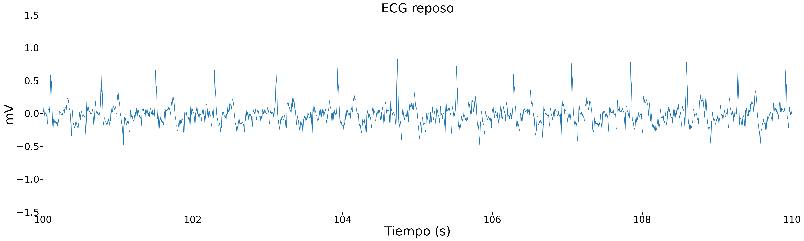
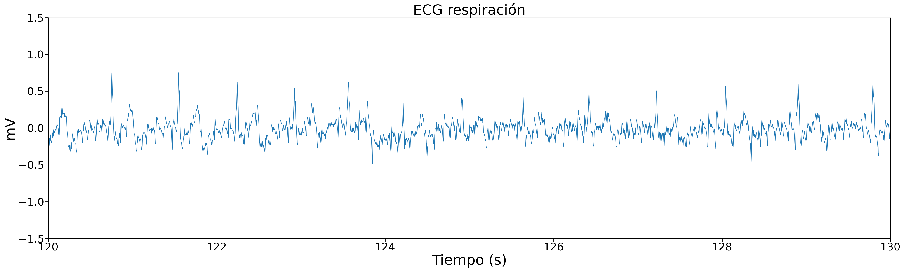
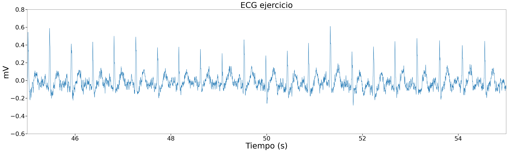
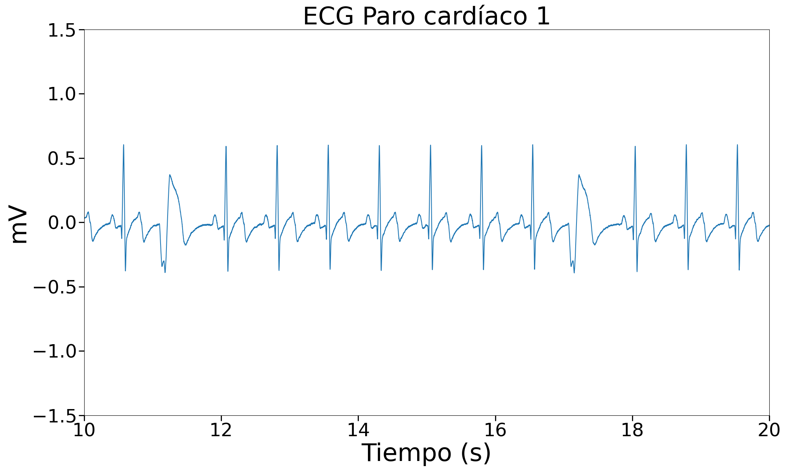
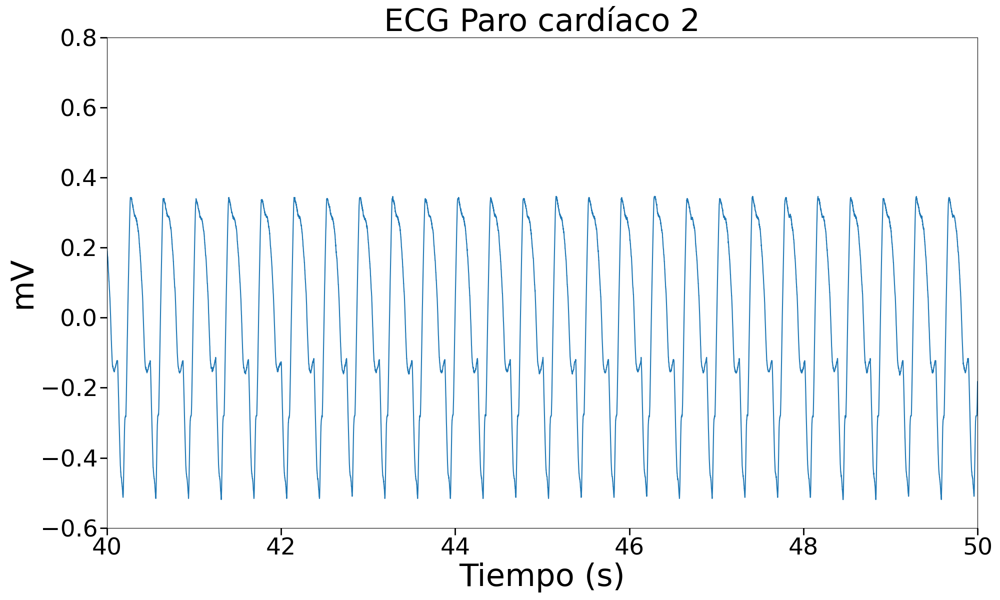
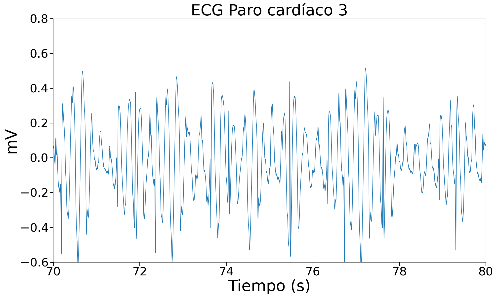
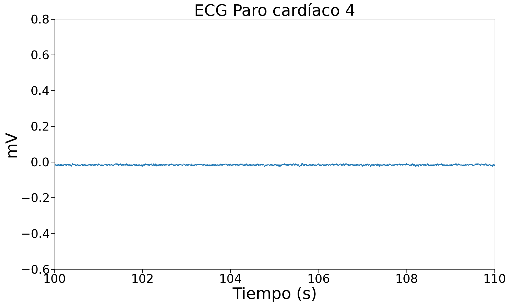

# Uso de BITalino para ECG
Lista de participantes:  
- Mantilla M., Ana Belen  
- Valdivia E., Erick Alexander   
- Flórez T., Armando Antonio  
- Taquiri D., Diego Alejandro  

## Tabla de contenidos
1. [Objetivos específicos de la práctica](https://github.com/diego-taquiri/ISB-equipo11/blob/main/Documentaci%C3%B3n/Laboratorio%204/BITalino_ECG.md#objetivos-espec%C3%ADficos-de-la-pr%C3%A1ctica)
2. [Materiales y métodos](https://github.com/diego-taquiri/ISB-equipo11/blob/main/Documentaci%C3%B3n/Laboratorio%204/BITalino_ECG.md#materiales-y-m%C3%A9todos)
3. [Resultados](https://github.com/diego-taquiri/ISB-equipo11/blob/main/Documentaci%C3%B3n/Laboratorio%204/BITalino_ECG.md#resultados)
   - [Videos mostrando las conexiones electrodos-cuerpo y la señal ploteada en OpenSignals](https://github.com/diego-taquiri/ISB-equipo11/blob/main/Documentaci%C3%B3n/Laboratorio%204/BITalino_ECG.md#videos-mostrando-las-conexiones-electrodos-cuerpo-y-la-se%C3%B1al-ploteada-en-opensignals)
   - [Archivo de los datos de la señal ploteada](https://github.com/diego-taquiri/ISB-equipo11/blob/main/Documentaci%C3%B3n/Laboratorio%204/BITalino_ECG.md#archivo-de-los-datos-de-la-se%C3%B1al-ploteada)
   - [Ploteo de las señales en Python](https://github.com/diego-taquiri/ISB-equipo11/blob/main/Documentaci%C3%B3n/Laboratorio%204/BITalino_ECG.md#ploteo-de-las-se%C3%B1ales-en-python)
4. [Discusión](https://github.com/diego-taquiri/ISB-equipo11/blob/main/Documentaci%C3%B3n/Laboratorio%204/BITalino_ECG.md#discusi%C3%B3n)
5. [Bibliografía](https://github.com/diego-taquiri/ISB-equipo11/blob/main/Documentaci%C3%B3n/Laboratorio%204/BITalino_ECG.md#bibliograf%C3%ADa)

### Objetivos específicos de la práctica
- Adquirir señales biomédicas de ECG.
- Hacer una correcta configuración de BiTalino.
- Extraer la información de las señales ECG del software OpenSignals (r)evolution.

### Materiales y métodos

Se realizó la medición de ECG de acuerdo a las instrucciones de la guía experimental de BITalino sobre electromiografía. [1] La medición se realizó utilizando un cable de electrodo de tres derivaciones conectado al terminal del BITalino correspondiente a ECG (Figura 1).  
   

  
<b>Figura 1.</b> Conexiones de los cables del electrodo en el BITalino.   

 Una posible configuración del sensor de ECG BITalino para Einthoven Lead I es posicionando los electrodos positivo y negativo en las muñecas, mientras que el de referencia sobre la cresta ilíaca. [1] Las posiciones pueden observarse en la figura 2.   

  

<b>Figura 2.</b> Colocación de electrodos para la derivación I: IN+ (rojo) e IN-(negro) en las muñecas y REF (blanco) en la cresta ilíaca. [1]   

El protocolo seguido para evaluar el latido del corazón en vivo con electrocardiografía fue el de la guía experimental de BITalino [1]:  
<ol>
  <li>Registrar una línea base de señal con poco ruido y sin movimientos (respiración normal) durante 30 segundos.</li>
  <li>Repetir un ciclo de INHALACIÓN-MANTENER-EXHALACIÓN-MANTENER tres veces, manteniendo la respiración y fases de reposo durante cinco segundos.</li>
  <li> Registrar otra fase inicial de 30 segundos.</li>
  <li> Realizar 10 burpees y observa tu frecuencia cardíaca antes y después del entrenamiento.</li>
  <li> Registrar otra fase inicial de 30 segundos.</li>
  <li> Realizar una inhalación larga (~10 segundos) seguida de contener la respiración durante varios segundos (~10 segundos).</li>
</ol>

Adicionalmente, se incorporó la simulación de un paro cardíaco haciendo uso del ProSim 4 - Vital signs simulator. Como puede observarse en la figura 3, hubo una equivocación en la colocación de los electrodos, lo cual podría afectar la calidad de la señal registrada y la interpretación de los datos. 
   

  
<b>Figura 3.</b> Conexiones de los cables del electrodo en el FLUKE.   

Siendo las autosecuencias una serie de pasos que cambian la salida del producto automáticamente, se tiene la siguiente tabla que representa los 5 pasos antes de producirse un paro cardíaco. [2]

  
<b>Figura 4.</b> Secuencia de parada cardíaca. [2]   

Asimismo, se puede observar lo descrito en esta tabla en el mismo FLUKE (Figura 5). Esta simulación fue posteriormente visualizada en el OpenSignals a través del BITalino.

      

    
    
    
    

<b>Figura 5.</b> Secuencia de parada cardíaca: (a)CVP, (b) Taquicardia ventricular, (c) Fibrilación ventricular severa y (d) Asistolia.   

### Resultados
#### Videos mostrando las conexiones electrodos-cuerpo y la señal ploteada en OpenSignals
- 
Protocolo seguido para evaluar el latido del corazón en vivo con electrocardiografía.

  

<b>Video X.</b> Video de la respiración normal.   

  

<b>Video X.</b> Video de ciclo de INHALACIÓN-MANTENER-EXHALACIÓN-MANTENER largo.   

  

<b>Video X.</b> Video de la fase inicial de 30 segundos.   
   

  

<b>Video X.</b> Video de los 10 burpees realizados.   
   

  

<b>Video X.</b> Video de la fase inicial de 30 segundos después de los burpees.   

  

<b>Video X.</b> Video del ciclo de INHALACIÓN-MANTENER-EXHALACIÓN-MANTENER largo.   

- 
Simulación de un paro cardíaco.

  

<b>Video X.</b> Video de la simulación de un paro cardíaco.   

#### Archivo de los datos de la señal ploteada
- [ECG raw data](https://github.com/diego-taquiri/ISB-equipo11/tree/main/Documentaci%C3%B3n/Laboratorio%204/ecg_raw_data)

#### Ploteo de las señales en Python
- 
Protocolo seguido para evaluar el latido del corazón en vivo con electrocardiografía.

    <table style="width:100%;">
        <tr>
            <th>Reposo</th>
        </tr>
        <tr>
            <td></td>
        </tr>
        <tr>
            <th>Respiración</th>
        </tr>
        <tr>
            <td></td>
        </tr>
        <tr>
            <th>Ejercicio</th>
        </tr>
        <tr>
            <td></td>
        </tr>
    </table>

- 
Simulación de un paro cardíaco.

    <table style="width:100%;">
        <tr>
            <th style="width:50%;">Paro cardíaco 1</th>
            <th style="width:50%;">Paro cardíaco 2</th>
        </tr>
        <tr>
            <td></td>
            <td></td>
        </tr>
        <tr>
            <th style="width:50%;">Paro cardíaco 3</th>
            <th style="width:50%;">Paro cardíaco 4</th>
        </tr>
        <tr>
            <td></td>
            <td></td>
        </tr>
    </table>

### Discusión
- 
<b>Respiración normal:</b>
- 
<b>Ciclo de INHALACIÓN-MANTENER-EXHALACIÓN-MANTENER:</b>
- 
<b>Respiración normal:</b>
- 
<b>Frecuencia cardíaca antes y después del entrenamiento:</b>
- 
<b>Respiración normal:</b>
- 
<b>Ciclo de INHALACIÓN-MANTENER-EXHALACIÓN-MANTENER largo:</b>
- 
<b>Simulación de un paro cardíaco:</b> 

### Bibliografía 

[1] BITalino (r)evolution Home Guide. PLUX-Wireless Biosignals, S A. Lisbon Portugal 2020. Disponible en: https://support.pluxbiosignals.com/wp-content/uploads/2022/04/HomeGuide2_ECG.pdf

[2] Users Manual, “Vital Signs Simulator”, Flukebiomedical.com. [En línea]. Disponible en: https://www.flukebiomedical.com/sites/default/files/resources/Pro4____umeng0300.pdf.
