# Filtros FIR e IIR
Lista de participantes:  
- Mantilla M., Ana Belen  
- Valdivia E., Erick Alexander   
- Flórez T., Armando Antonio  
- Taquiri D., Diego Alejandro  

## Tabla de contenidos
1. [Introducción](https://github.com/diego-taquiri/ISB-equipo11/blob/main/Documentaci%C3%B3n/Laboratorio%206/README.md#introducci%C3%B3n)
2. [Objetivos específicos de la práctica](https://github.com/diego-taquiri/ISB-equipo11/blob/main/Documentaci%C3%B3n/Laboratorio%206/README.md#objetivos-espec%C3%ADficos-de-la-pr%C3%A1ctica)
3. [Materiales y métodos](https://github.com/diego-taquiri/ISB-equipo11/blob/main/Documentaci%C3%B3n/Laboratorio%206/README.md#materiales-y-m%C3%A9todos)
4. [Resultados](https://github.com/diego-taquiri/ISB-equipo11/blob/main/Documentaci%C3%B3n/Laboratorio%206/README.md#resultados)
   - [Tabla resumen ECG](https://github.com/diego-taquiri/ISB-equipo11/blob/main/Documentaci%C3%B3n/Laboratorio%206/README.md#tabla-resumen-ecg)
   - [Tabla resumen EMG ](https://github.com/diego-taquiri/ISB-equipo11/blob/main/Documentaci%C3%B3n/Laboratorio%206/README.md#tabla-resumen-emg)
   - [Tabla resumen EEG](https://github.com/diego-taquiri/ISB-equipo11/blob/main/Documentaci%C3%B3n/Laboratorio%206/README.md#tabla-resumen-eeg)
5. [Discusión](https://github.com/diego-taquiri/ISB-equipo11/blob/main/Documentaci%C3%B3n/Laboratorio%206/README.md#discusi%C3%B3n)
6. [Bibliografía](https://github.com/diego-taquiri/ISB-equipo11/blob/main/Documentaci%C3%B3n/Laboratorio%206/README.md#bibliograf%C3%ADa)

### Introducción

 Las señales ECG, EEG y EMG pueden ser clasificadas juntas dentro del grupo de señales bioeléctricas. Este tipo de señal describe la suma de las señales eléctricas que acompañan a una contracción mecánica de una sola célula cuando es estimulada por una corriente eléctrica, ya sea neural o externa [1].
Sin embargo, estas señales son bastante complejas asique son propensas a adquirir ruido y no linealidades mientras viajan a través de diferentes tejidos e interfaces como electrodos y circuitos de procesamiento de señales electrónicas. Por lo tanto, la detección y procesamiento de señales ECG se ha convertido en un requisito muy importante en ingeniería biomédica [2]. Por ende el diseño de diferentes tipos de filtros para aplicar en el procesamiento de estas señales es un área bastante explorada hoy en día. 
   

 El término filtro se utiliza habitualmente para describir un dispositivo que discrimina, de acuerdo con algún atributo de los objetos aplicados a su entrada, lo que pasa a través. El filtrado se emplea de formas muy variadas en el procesamiento digital de señales; por ejemplo, para eliminar el ruido indeseado que pueda existir en las señales deseadas, para conformación espectral en la ecualización de canales de comunicación, en la detección de señales de radar, sonar y de comunicaciones y para realizar el análisis espectral de señales, etc. Por tanto, seleccionando adecuadamente los coeficientes, se puede diseñar filtros selectivos de frecuencia que dejan pasar señales con componentes de frecuencia en determinadas bandas mientras que atenúan señales que contienen frecuencias en otras bandas. Normalmente, los filtros se clasifican de acuerdo con sus características en el dominio de la frecuencia como filtros paso bajo, paso alto, paso banda, banda eliminada y paso todo. [3]
   

  

<b>Figura 1.</b> Módulo de las respuestas de algunos filtros discretos en el tiempo y selectivos en frecuencia [3].   

Sin embargo, también es conveniente subdividir la clase de sistemas lineales invariantes en el tiempo en dos tipos: aquellos que tienen una repuesta al impulso de duración finita (FIR, finite-duration impulse response) y aquellos que tienen una respuesta al impulso de duración infinita (IIR, infinite-duration impulse response). En la práctica, los filtros FIR se emplean en problemas de filtrado en los que se precisa una característica de fase dentro de la banda de paso del filtro. Si no se necesita esta característica de fase lineal, puede emplearse un filtro IIR o FIR. Por regla general, un filtro IIR tiene lóbulos secundarios más pequeños en la banda eliminada que un filtro FIR con el mismo número de parámetros. Por esta razón, si es tolerable cierta distorsión, es preferible un filtro IIR, principalmente porque su implementación precisa muy pocos parámetros, requiere menos memoria y presenta menos complejidad de cálculo [3].

  

<b>Figura 2.</b> Módulo de los filtros físicamente realizables [3].   
   

En este laboratorio, se abordará el diseño de filtros IIR por medio de transformación bilineal. Hay varios tipos comunes de filtros analógicos: Butterworth, que tienen bandas de paso máximamente planas en filtros del mismo orden, Chebyshev tipo I que son equivariables en la banda de paso, Chebyshev tipo II que son equivariables en la banda de parada, y filtros elípticos que son equivariables tanto en la banda de paso y la banda de parada. La versión digital de estos se puede obtener a partir de diseños analógicos a través de la transformación bilineal [4]. En comparación, para FIR, las técnicas de diseño para filtros digitales, se trabajarán con el método de ventana, el cual comienza con una respuesta de muestra unitaria deseada que luego se trunca mediante una ventana de duración finita [5]. Los distintos tipos de filtro FIR e IIR son visualizados a continuación.

      

    
    

<b>Figura 3.</b> (a) Módulo de las respuestas de los filtros de Bessel y Butterworth de orden N = 4 y (b) formas de varias funciones de ventana [3].   
      
### Objetivos específicos de la práctica
- Diseñar filtros FIR e IIR con los datasets de los laboratorios anteriores.
- Filtrar de manera óptima las frecuencias altas de las señales de ECG que corresponden a ruido.
- Filtrar las señales EMG para eliminar ruido y artefactos, y aislar la actividad muscular efectiva.
- Preprocesar señales EEG para reducir el ruido y extraer características de interés como ondas cerebrales específicas.

### Materiales y métodos
#### ECG
#### EMG
#### EEG

  

<b>Figura 1.</b> Bandas de frecuencia de EEG, ocurrencia y tareas para activar la potencia de la banda.   

### Resultados
#### Tabla resumen ECG 
| Campo | Señal cruda | Filtro IIR | Filtro FIR |
| --------- | ---------- | ------------------------------ | ---------------------- |
| Basal | 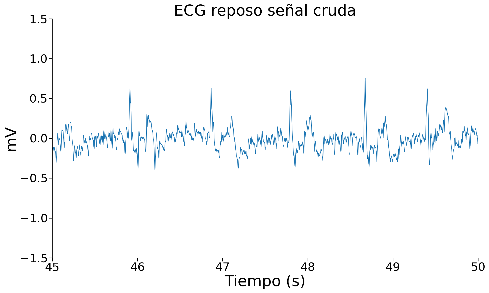 |  | 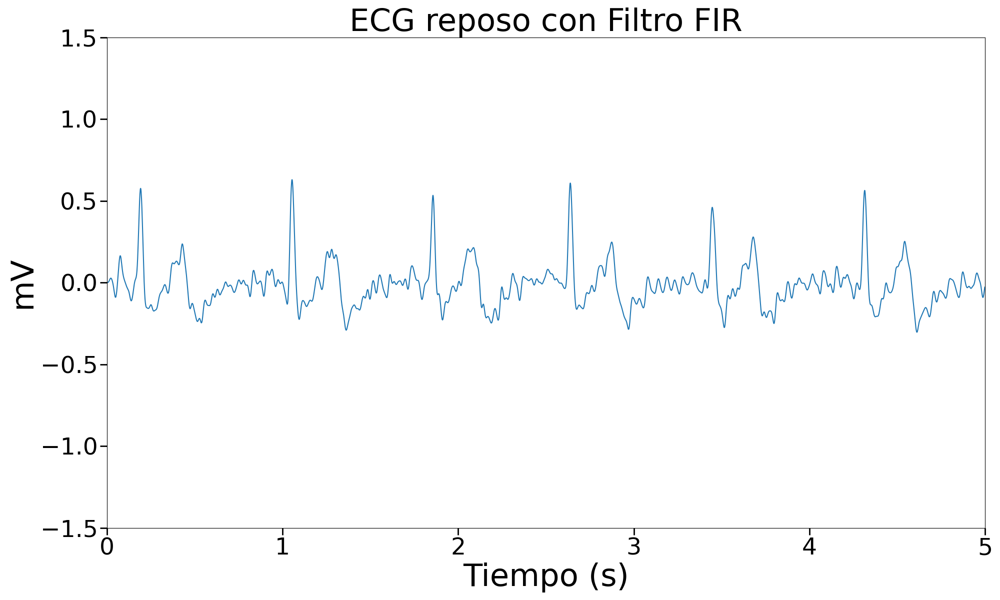 |
 Respiración | 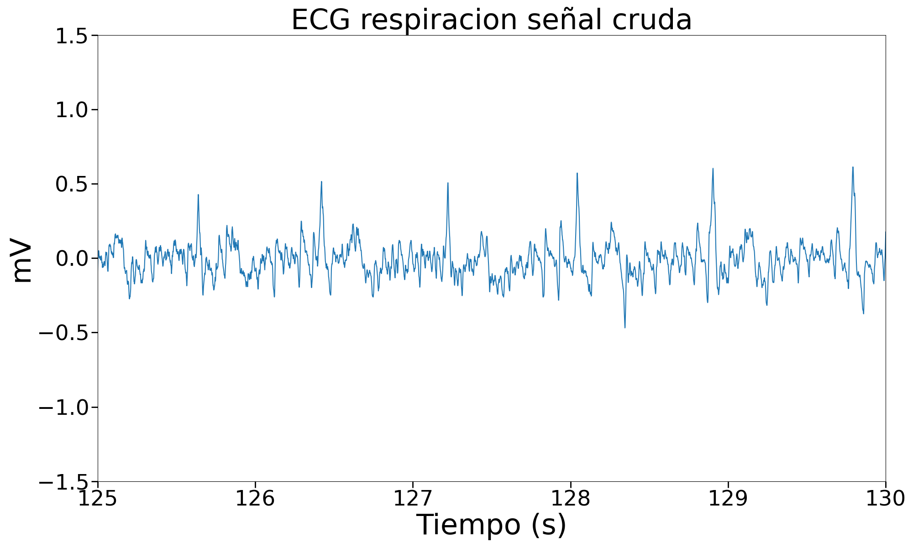 |  | 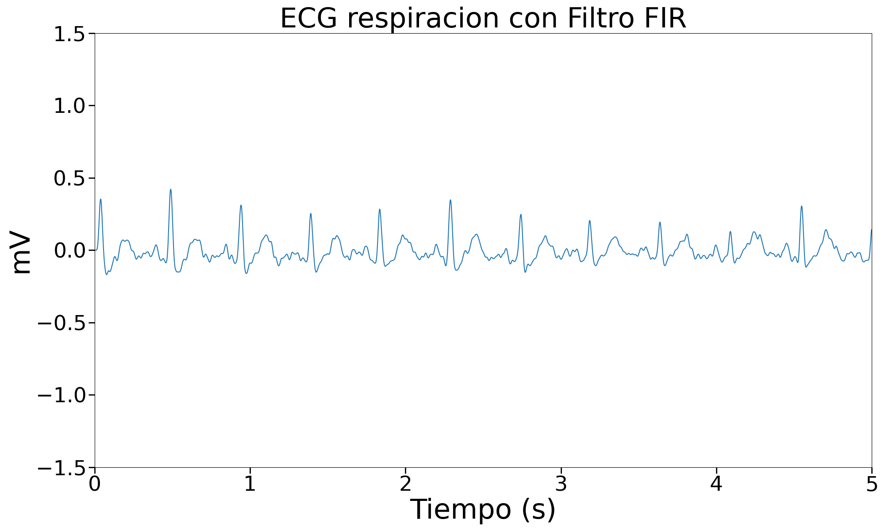 |
| Ejercicio | 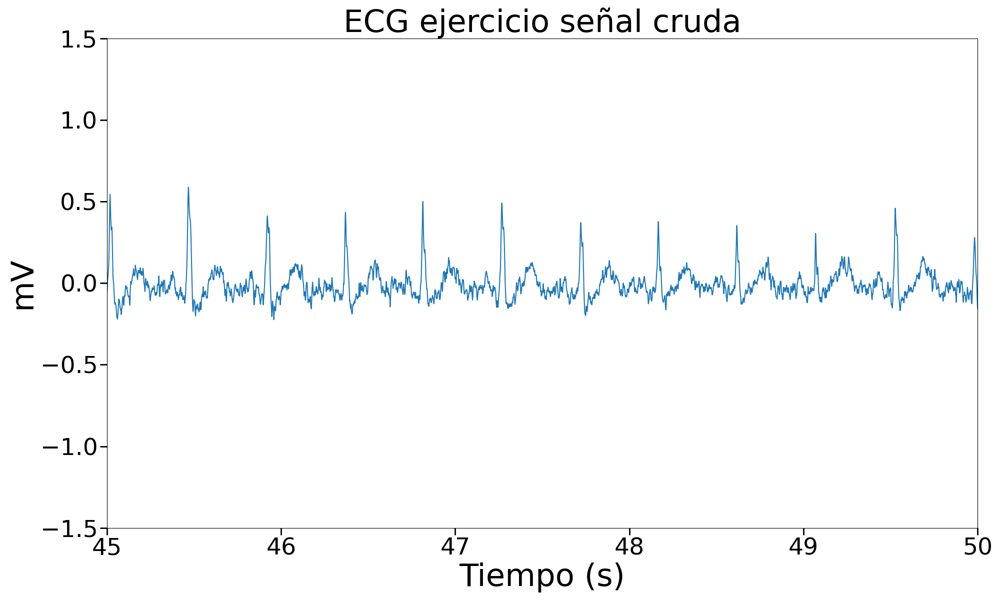 | 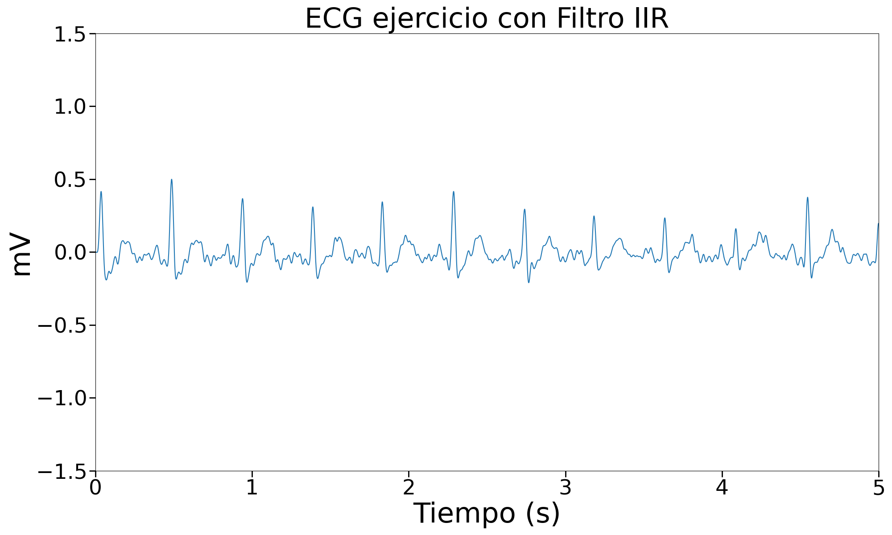 |  |

#### Tabla resumen EMG 
| Estado | Señal cruda | Filtro IIR | Filtro FIR |
| ------------ | -------------- | ------------------ | ------------------ |
| Reposo | 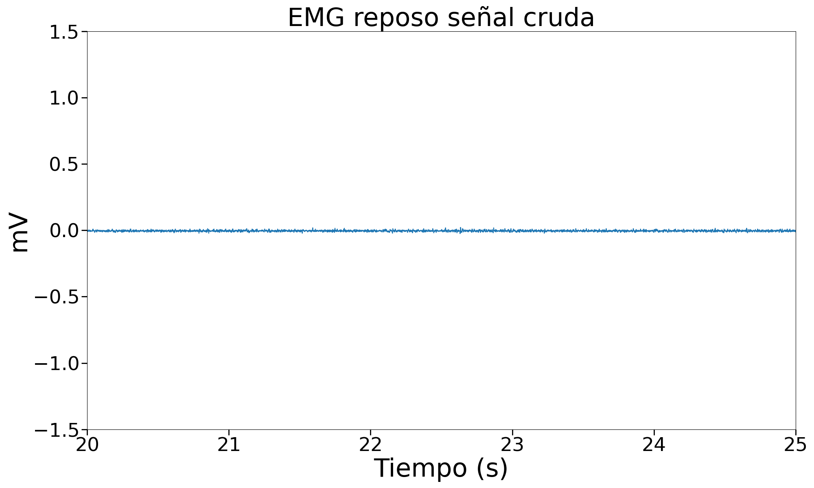 |  | 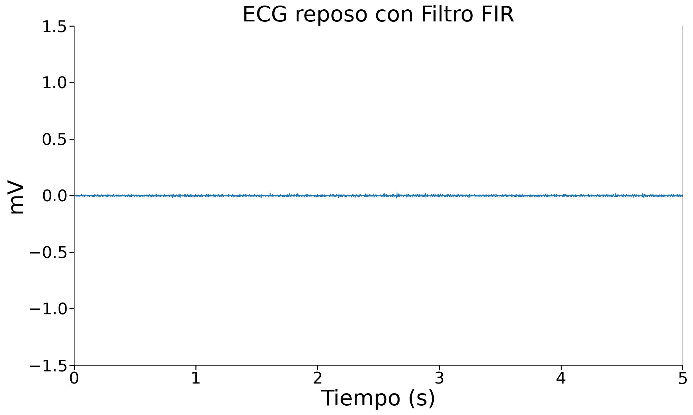 |
| Contracción leve | 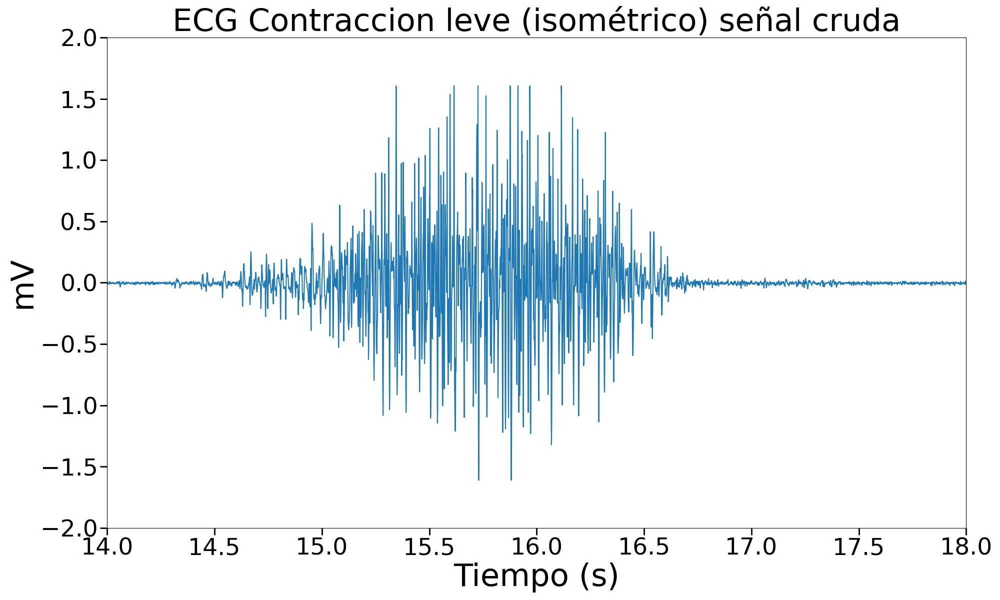 |  |  |
| Contracción fuerte | 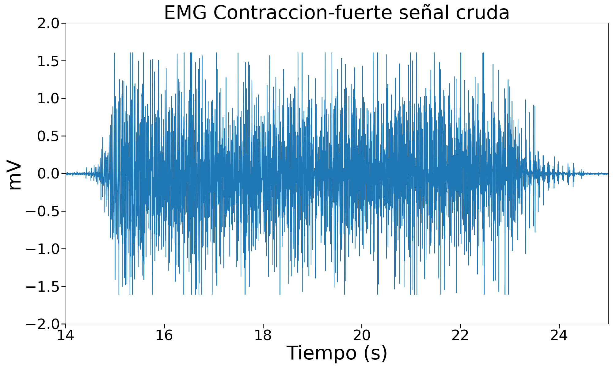 |  | 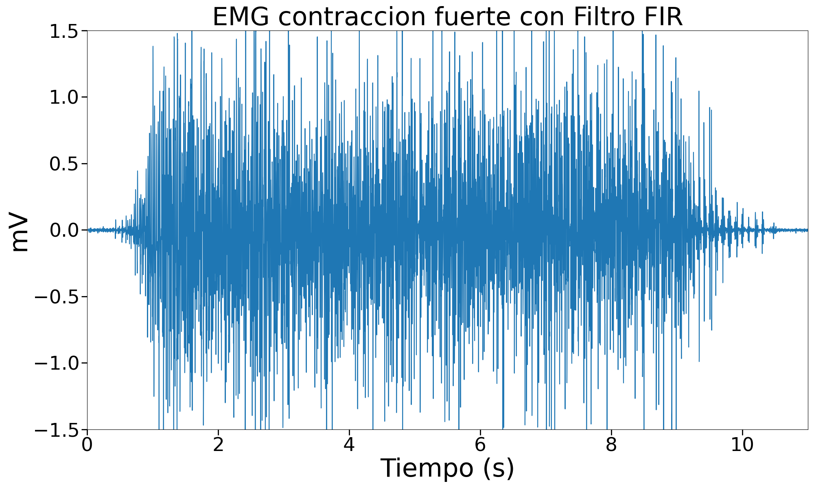 |

#### Tabla resumen EEG 
### Discusión

Filtración de EMG

A traves de los resultados obtenidos por el filtro FIR de ventana Hamming y el filtro IIR de metodo Butterworth, podemos observar que el filtro FIR proporciona resultados más entendibles con menos ruido y picos más pronunciados. Este resultado coincide con el estudio realizado por Liu, S. [6], el cual hizo uso de los mismos tipos de filtros en señales EMG y encontro que el SNR o Signal to Noise Ratio es mayor en los filtros FIR ademas de mostrar un tiempo de ejecución mucho menor. Estos parametros son indicadores de una mejor filtración de señal.

### Bibliografía

[1]  Martinek R, Ladrova M, Sidikova M, Jaros R, Behbehani K, Kahankova R, Kawala-Sterniuk A. Advanced Bioelectrical Signal Processing Methods: Past, Present and Future Approach-Part I: Cardiac Signals. Sensors (Basel). 2021 Jul 30;21(15):5186. doi: 10.3390/s21155186. PMID: 34372424; PMCID: PMC8346990. 

[2] Adimulam, M. K., & Srinivas, M. . (2016). Modeling of EXG (ECG, EMG and EEG) non-idealities using MATLAB. 2016 9th International Congress on Image and Signal Processing, BioMedical Engineering and Informatics (CISP-BMEI). doi:10.1109/cisp-bmei.2016.7852968

[3] J. G. Proakis y D. G. Manolakis, Tratamiento digital de señales. Old Tappan, NJ, Estados Unidos de América: Prentice Hall, 2007.

[4] “DT Filter Design: IIR Filters”, Mit.edu, 2006. [En línea]. Disponible en: https://ocw.mit.edu/courses/6-341-discrete-time-signal-processing-fall-2005/51e3beff8c8ce2289ba292fcdb0040f4_lec08.pdf.

[5] A. V. Oppenheim, “Design of FIR digital filters”, Mit.edu, 2011. [En línea]. Disponible en: https://ocw.mit.edu/courses/res-6-008-digital-signal-processing-spring-2011/aea8444ff81fdeed9c2b66dccebbce47_MITRES_6_008S11_lec17.pdf.

[6] Liu, S., Sabrina, N., & Hardson, H. (2023). Comparison of FIR and IIR Filters for Audio Signal Noise Reduction. Ultima Computing : Jurnal Sistem Komputer, 15(1), 19-24. https://doi.org/https://doi.org/10.31937/sk.v15i1.3171
