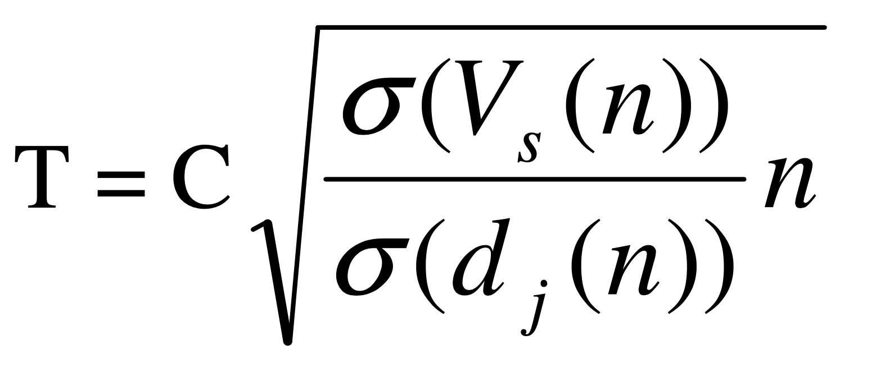
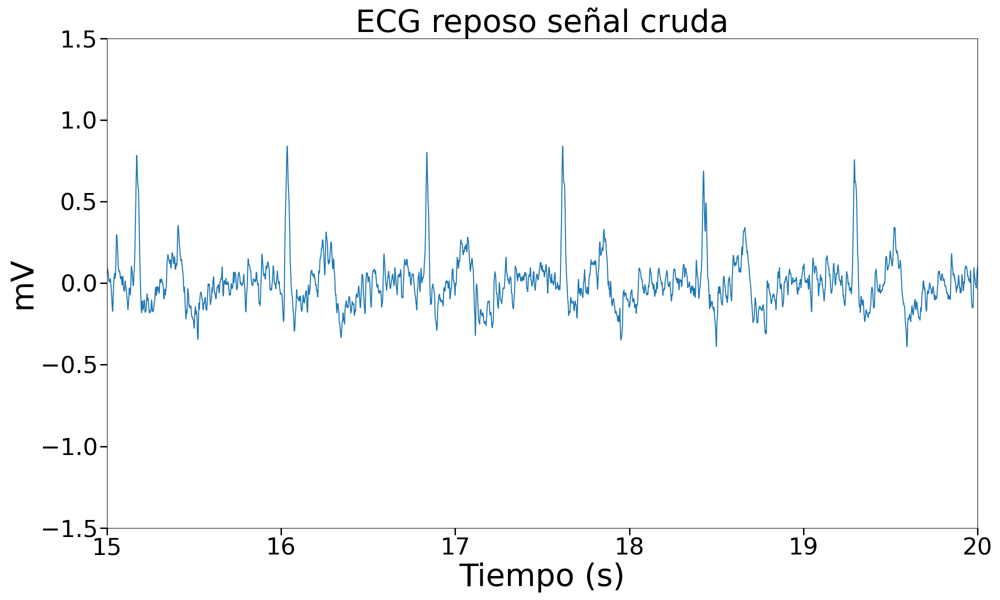
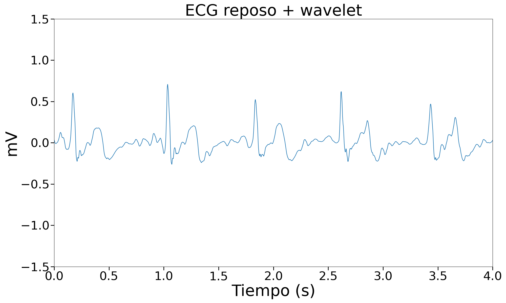
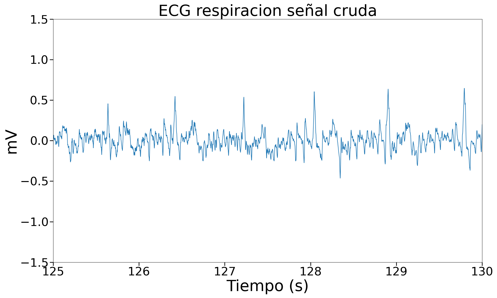
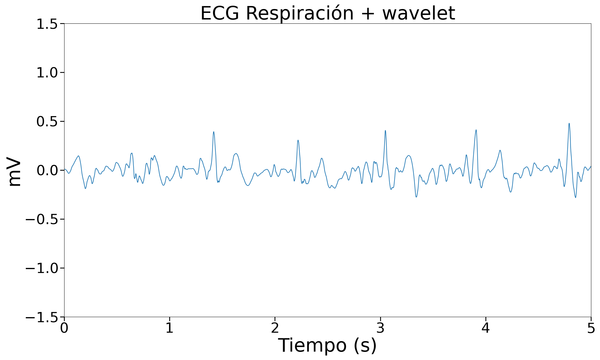
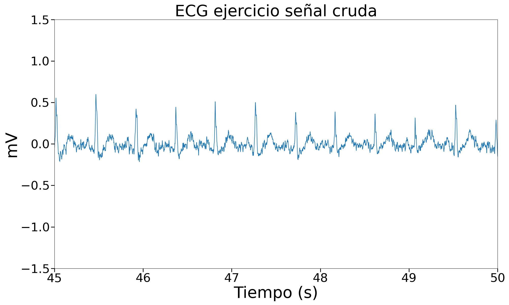
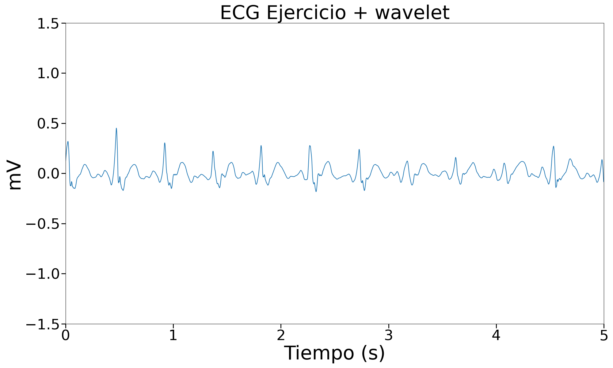

# Transformada Wavelet
Lista de participantes:  
- Mantilla M., Ana Belen  
- Valdivia E., Erick Alexander   
- Flórez T., Armando Antonio  
- Taquiri D., Diego Alejandro  

## Tabla de contenidos
1. [Introducción](https://github.com/diego-taquiri/ISB-equipo11/blob/main/Documentaci%C3%B3n/Laboratorio%207/Wavelet.md#introducci%C3%B3n)
2. [Objetivos específicos de la práctica](https://github.com/diego-taquiri/ISB-equipo11/blob/main/Documentaci%C3%B3n/Laboratorio%207/Wavelet.md#objetivos-espec%C3%ADficos-de-la-pr%C3%A1ctica)
3. [Materiales y métodos](https://github.com/diego-taquiri/ISB-equipo11/blob/main/Documentaci%C3%B3n/Laboratorio%207/Wavelet.md#materiales-y-m%C3%A9todos)
5. [Resultados](https://github.com/diego-taquiri/ISB-equipo11/blob/main/Documentaci%C3%B3n/Laboratorio%207/Wavelet.md#resultados)
   - [Tabla resumen ECG](https://github.com/diego-taquiri/ISB-equipo11/blob/main/Documentaci%C3%B3n/Laboratorio%207/Wavelet.md#tabla-resumen-ecg)
   - [Tabla resumen EMG ](https://github.com/diego-taquiri/ISB-equipo11/blob/main/Documentaci%C3%B3n/Laboratorio%207/Wavelet.md#tabla-resumen-emg)
   - [Tabla resumen EEG](https://github.com/diego-taquiri/ISB-equipo11/blob/main/Documentaci%C3%B3n/Laboratorio%207/Wavelet.md#tabla-resumen-ecg)
6. [Discusión](https://github.com/diego-taquiri/ISB-equipo11/blob/main/Documentaci%C3%B3n/Laboratorio%207/Wavelet.md#discusi%C3%B3n)
7. [Bibliografía](https://github.com/diego-taquiri/ISB-equipo11/blob/main/Documentaci%C3%B3n/Laboratorio%207/Wavelet.md#bibliograf%C3%ADa)

### Introducción
<p align="justify"> Las señales ECG, EEG y EMG pueden ser clasificadas juntas dentro del grupo de señales bioeléctricas. Este tipo de señal describe la suma de las señales eléctricas que acompañan a una contracción mecánica de una sola célula cuando es estimulada por una corriente eléctrica, ya sea neural o externa [1]. Sin embargo, estas señales son bastante complejas así que son propensas a adquirir ruido y no linealidades mientras viajan a través de diferentes tejidos e interfaces como electrodos y circuitos de procesamiento de señales electrónicas. Por lo tanto, la detección y procesamiento de señales ECG se ha convertido en un requisito muy importante en ingeniería biomédica [2]. Por ende el diseño de diferentes tipos de filtros para aplicar en el procesamiento de estas señales es un área bastante explorada hoy en día. 

<p align="justify">En este laboratorio, se explorarán las wavelets o "pequeñas ondas" del procesamiento de señales, las cuales pasaron a primer plano a principios de la década de 1990 como una alternativa atractiva al procesamiento clásico de señales e imágenes basado en la transformada de Fourier. [3]

### Objetivos específicos de la práctica
- 

### Materiales y métodos

#### ECG

<p align="justify">La señal ECG utilizada en este trabajo fue adquirida mediante un dispositivo BITalino, utilizando el canal 2 para la recolección de datos. La frecuencia de muestreo fue de 1000 Hz y el BITalino realiza la cuantización de la señal a 10 bits. Inicialmente, la cuantización de 10 bits cubre un rango de 0 a 3.3 mV [4]. Para convertir la señal cruda de bits a milivoltios y centrarla, se utilizó la siguiente relación de conversión:

```python
data_mV = (data[:, 5] * volt_range / (2 ** bits - 1)) - media(data_mV)
```

<p align="justify">Esta conversión permitió adecuar la señal para el posterior procesamiento.

<p align="justify">La metodología utilizada para el filtrado de la señal ECG usando wavelet se basa en la implementación propuesta por Alfaouri y Daqrouq en su artículo "ECG signal denoising by wavelet transform thresholding" [5]. En este estudio, se destaca la importancia del uso de la transformada wavelet para la eliminación de ruido en señales ECG no estacionarias. Los autores proponen un método de umbralización de coeficientes wavelet para la mejora de la relación señal-ruido y que preserva las características morfológicas de la señal ECG. 

<p align="justify">Siguiendo la implentación del artículo, se utilizó la aplicación de wavelets Daubechies 4 (db4) y un umbral suave para la eliminación de ruido. A continuación, se detallan los pasos seguidos en la metodología:

<p align="justify">1. **Descomposición de la señal**: La señal ECG fue descompuesta utilizando la función `pywt.wavedec` con wavelets db4 hasta un nivel de descomposición de 5. Esta función descompone la señal original en un conjunto de coeficientes de aproximación y detalle, que representan las diferentes frecuencias presentes en la señal.

    ```python
    coeffs = pywt.wavedec(y_1, 'db4', level=5)
    ```

<p align="justify">2. **Cálculo de umbrales**: Se calculó un umbral adaptativo para cada nivel de detalle utilizando la desviación estándar de la señal y los coeficientes de detalle. El umbral \(T\) para cada nivel se calculó usando la siguiente fórmula:

<p align="center">

<p align="center"><b>Figura 1.</b> Fórmula para el cálculo de los umbrales. <br> 

<p align="justify">Donde \(C\) es una constante (0.01 en nuestro caso, elegida experimentalmente para nuestras señales), \(\sigma_{Vs}\) es la desviación estándar de la señal original, \(\sigma_{dj}\) es la desviación estándar de los coeficientes de detalle en cada nivel, y \(n\) es el número de muestras de la señal. j representa el número de niveles (en nuestro caso hasta 5 niveles), donde \(d_j\) son los coeficientes de detalle y \(n\) es el número de muestras para cada señal.

```python
    def calculate_T(coeffs, n, C):
        sigma_Vs = np.std(y_1)
        dj = [coeffs[i] for i in range(1, len(coeffs))]
        sigma_dj = [np.std(d) for d in dj]
        T = [C * np.sqrt((sigma_Vs / sigma) * n) for sigma in sigma_dj]
        return T

    n = len(y_1)
    T_values = calculate_T(coeffs, n, C)
```

<p align="justify">3. **Aplicación de umbrales suaves**: Los coeficientes de detalle fueron umbralizados utilizando el umbral suave (`soft thresholding`). Este proceso reduce los coeficientes menores al umbral, manteniendo la estructura general de la señal pero eliminando el ruido. Se utilizó la función `pywt.threshold` para aplicar este umbral.

    ```python
    def soft_threshold(coeffs, T_values):
        thresholded_coeffs = coeffs.copy()
        for i in range(1, len(coeffs)):
            thresholded_coeffs[i] = pywt.threshold(coeffs[i], T_values[i-1], mode='soft')
        return thresholded_coeffs

    thresholded_coeffs = soft_threshold(coeffs, T_values)
    ```

<p align="justify">4. **Reconstrucción de la señal**: Finalmente, la señal fue reconstruida a partir de los coeficientes umbralizados utilizando la función `pywt.waverec`, obteniendo una señal denoised y filtrada.

    ```python
    y_denoised = pywt.waverec(thresholded_coeffs, 'db4')
    ```

#### EMG

#### EEG
<p align="justify">Para el filtrado de señal EEG, se utilizó la señal de EEG tomada mediante BITalino en tres instancias, reposo, apertura y cierre de ojos, y resolución mental de ejercicios matemáticos. El filtrado de la señal se realizó utilizando los criterios mencionados por Mamun et al.[ Md. Mamun, M. Al-Kadi, y Mohd. Marufuzzaman, «Effectiveness of Wavelet Denoising on Electroencephalogram Signals», Journal of Applied Research and Technology, vol. 11, n.o 1, pp. 156-160, feb. 2013, doi: 10.1016/S1665-6423(13)71524-4.] Se utilizó una función Wavelet Daubechies8 (db8) con 4 niveles de descomposición, el cual utiliza un umbral de ruido o threshold determinado por la siguiente ecuación: </b>

<p align="justify">Donde:
   - La desviación media absoluta(delta_mad) es la media de los valores absolutos de los coeficientes de wavelet entre 0.6745 (estimador de la desviación estándar para ruido blanco gaussiano)
   - N es el número de muestras de la señal.

### Resultados
#### Tabla resumen ECG 
| Campo        | Señal cruda                                                   | Señal + Wavelet                                                    |
|--------------|---------------------------------------------------------------|---------------------------------------------------------------|
| Basal        |        |               |
| Respiración  |              |                |
| Ejercicio    |    |           |


#### Tabla resumen EMG 
| Estado | Señal cruda | Filtro IIR | Filtro FIR |
| ------------ | -------------- | ------------------ | ------------------ |
| Reposo |  |  |  |
| Flexión isotónica |  |  |  |
| Flexión isométrica |  |  |  |

#### Tabla resumen EEG 
| Estado | Señal cruda | Filtro IIR | Filtro FIR |
| ------------ | -------------- | ------------------ | ------------------ |
| Reposo |  |  |  |
| Apertura y cierre de ojos |  |  |  |
| Resolución de ejercicios matemáticos |  |  |  |

### Discusión
<p align="justify"><b>Filtración de ECG:</b>
<p align="justify"> Easadas
<p align="justify"><b>Filtración de EMG:</b>
<p align="justify"> sdada
<p align="justify"><b>Filtración de EEG:</b>
<p align="justify">Se puede observar un suavizado de la señal eletroencefalográfica como resultado del filtro de wavelet con las características planteadas. Como se puede apreciar en las imágenes de las señales de salida, tras utilizar la transformada de wavelet, la forma de la onda no considera las espículas que son influencia de frecuencias mayores en el espectro.   Debido a que la señal EEG carece de un patrón identificable en el dominio del tiempo, el suavizado de la señal puede apreciarse de mejor forma en un espectrograma, donde se aprecia que las frecuencias por encima de los 50Hz se han visto reducidas en amplitud.

<p align="justify">La literatura indica tres orígenes fisiológicos de ruido en las señales EEG. Los movimientos de ojo ocasionan un cambio en el campo eléctrico que rodea los mismos mediante la formación de dipolos en la retina y movimientos de las pestañas, generando potenciales en el cuero cabelludo [R. J. Croft and R. J. Barry, “Removal of ocular artifact from the EEG: a review,” Neurophysiologie clinique, vol. 30, no. 1, pp. 5–19, Feb. 2000, doi: https://doi.org/10.1016/s0987-7053(00)00055-1.]. Su espectro se sobrelapa con las ondas alfa del EEG en tareas mentales, y debido a su mayor amplitud, pueden llegar a suprimirlas [S. Zahan, "Removing EOG artifacts from EEG signal using noise-assisted multivariate empirical mode decomposition," 2016 2nd International Conference on Electrical, Computer & Telecommunication Engineering (ICECTE), Rajshahi, Bangladesh, 2016, pp. 1-5, doi: 10.1109/ICECTE.2016.7879634.].  Las señales electromiográficas son un ruido común en mediciones de ondas beta y gamma, y debido a su amplitud ocluyen la señal EEG a partir de los 20 Hz, siendo esta oclusión mayor a partir de los 50Hz. [K. J. Pope et al., “Managing electromyogram contamination in scalp recordings: An approach identifying reliable beta and gamma EEG features of psychoses or other disorders,” Brain and behavior, vol. 12, no. 9, Aug. 2022, doi: https://doi.org/10.1002/brb3.2721.] 

### Bibliografía
<p align="justify">[1]  Martinek R, Ladrova M, Sidikova M, Jaros R, Behbehani K, Kahankova R, Kawala-Sterniuk A. Advanced Bioelectrical Signal Processing Methods: Past, Present and Future Approach-Part I: Cardiac Signals. Sensors (Basel). 2021 Jul 30;21(15):5186. doi: 10.3390/s21155186. PMID: 34372424; PMCID: PMC8346990. 
<p align="justify">[2] Adimulam, M. K., & Srinivas, M. . (2016). Modeling of EXG (ECG, EMG and EEG) non-idealities using MATLAB. 2016 9th International Congress on Image and Signal Processing, BioMedical Engineering and Informatics (CISP-BMEI). doi:10.1109/cisp-bmei.2016.7852968
<p align="justify">[3] “Wavelets: Multiscale edge detection and image denoising”, en Embedded Image Processing on the TMS320C6000TM DSP, Boston, MA: Springer US, 2005, pp. 281–378.
<p align="justify">[4] PLUX – Wireless Biosignals, S.A., "Electrocardiography (ECG) Sensor Data Sheet," Rev. B, 2020. [Online]. Available: https://bitalino.com/storage/uploads/media/revolution-ecg-sensor-datasheet-revb-1.pdf. 
<p align="justify">[5] M. Alfaouri and K. Daqrouq, "ECG signal denoising by wavelet transform thresholding," American Journal of Applied Sciences, vol. 5, no. 3, pp. 276-281, 2008. doi: 10.3844/ajassp.2008.276.281.
